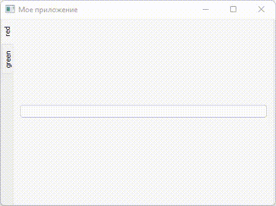

# Лабораторная работа №3

## Задание №1

Создайте приложение с любыми настройками окна. Добавьте в окно виджет-таблицу с одной вкладкой, в которой будет располагаться горизонтальный макет. Добавьте в этот макет несколько разных виджетов.

## Задание №2

Добавьте в виджет-таблицу из первого задания еще две вкладки:

- На второй вкладке будет расположен сетчетый макет. Создайте поле из кнопок 30x30, которые будут располагаться вплотную друг к другу.
- На третьей вкладке будет расположен вертикальный макет. Добавьте в макет одну кнопку. При нажатии на эту кнопку должен создаваться новый горизонтальный макет внутри вертикального макета в котором будут располагаться две кнопки с точно таким же функционалом. После нажатия на любую кнопку она становится недоступной для повторного нажатия (Для того, чтобы узнать какая кнопка была нажата, можно использовать метод `sender` у окна).

Пример можно увидеть в этом видео:

