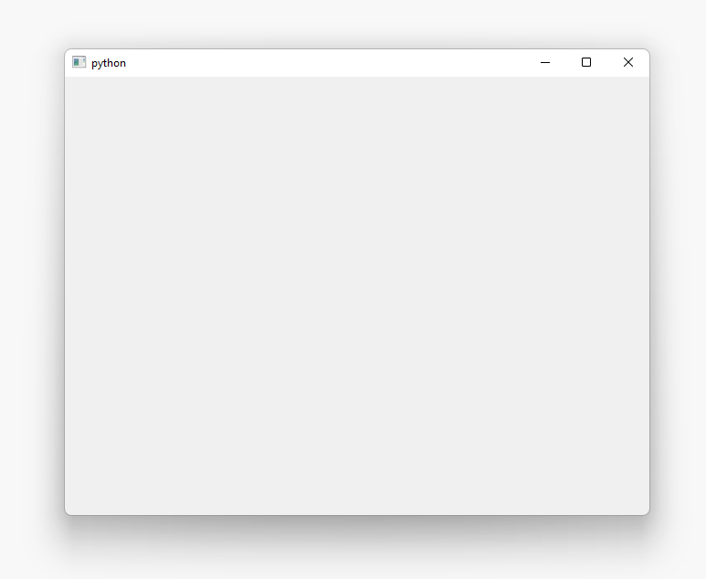
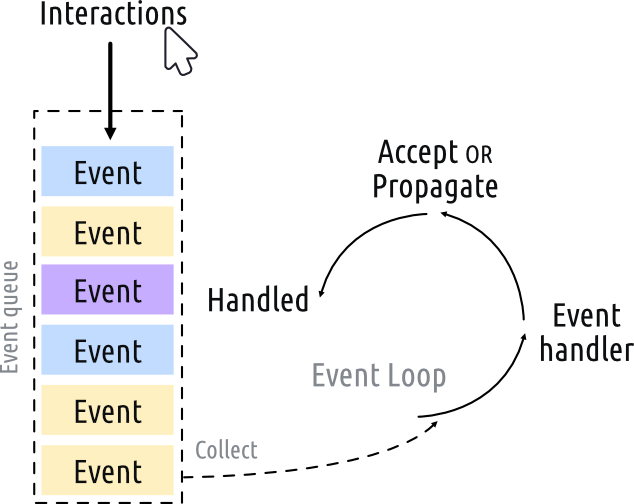
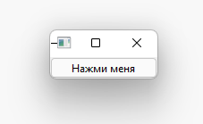
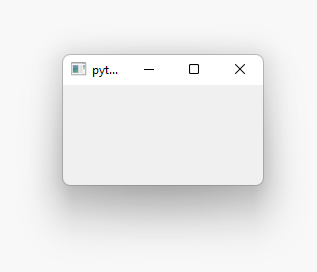
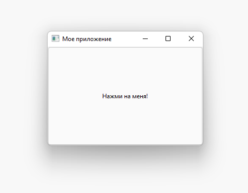
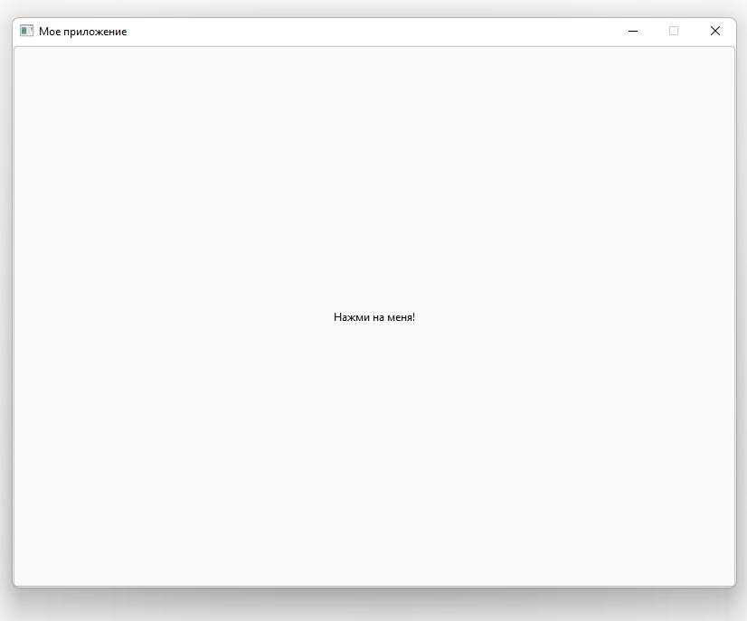

# Создаём первое приложение на Qt

## Создание приложения

Создадим первое приложение. Для начала необходимо создать python файл и с любым названием (в примерах будет именоваться как ```main.py```). Внутри файла записываем следующий код:
```python
import PySide2.QtWidgets as psqw

app = psqw.QApplication()

window = psqw.QWidget()
window.show()

app._exec()
```

Теперь запустим приложение. Сделать это можно через консоль с помощью команды:
```python
python main.py
```
или средствами вашей среды разработки. После запуска откроется окно нашего приложения. ```Qt``` автоматически создаст окно размером, оптимальным для вашего экрана.



### Разбор кода из примера выше

Первым делом мы импортируем один из основных модулей ```Qt``` модуль `PySide2.QtWidgets` в котором имеются классы нужные для приложения:

```python
import PySide2.QtWidgets as psqw
```

Вы можете подключать модули как используя ```import <module>```, так и ```from <module> import``` в зависимости от ваших личных предпочтений.

Затем создаём экземпляр приложения ```QApplication```:

```python
app = psqw.QApplication()
```

Далее создаём экземпляр виджета ```QWidget``` и даём ему имя ```window```. В ```Qt``` все виджеты верхнего уровня являются окнами, то есть они не имеют родителя и не вложены в другой виджет или макет. Это означает, что технически вы можете создать окно, используя любой виджет, который вам нравится.

```python
window = psqw.QWidget()
window.show()
```

> Виджеты без родителя по умолчанию невидимы. Поэтому после создания объекта окна мы всегда должны вызывать у него метод ```show```, чтобы сделать его видимым.

Наконец, мы вызываем у приложения метод ```_exec``` для запуска цикла событий:

```python
app._exec()
```

## Событийный цикл

Прежде чем вывести окно на экран, необходимо представить несколько ключевых концепций организации приложений в мире ```Qt```.

Ядром каждого приложения ```Qt``` является класс ```QApplication```. Каждому приложению для работы нужен один и только один объект ```QApplication```. Этот объект содержит цикл событий вашего приложения - основной цикл, который управляет всем взаимодействием пользователя с графическим интерфейсом.



Каждое взаимодействие (interaction) с вашим приложением, будь то нажатие клавиши, щелчок мышью или движение мыши, генерирует событие (event), которое помещается в очередь событий (event queue). В цикле событий очередь проверяется на каждой итерации, и если ожидающее событие найдено, событие и управление передаются конкретному обработчику событий (event handler) для этого события. Обработчик событий обрабатывает событие, а затем передает управление обратно в цикл обработки событий, чтобы дождаться новых событий. Для каждого приложения существует только один цикл обработки событий.

> Класс ```QApplication``` содержит цикл событий ```Qt```. Требуется только один экземпляр ```QApplication``` в вашем приложении.

## QMainWindow

Как мы выяснили ранее, в ```Qt``` любые виджеты могут быть окнами. Например, если вы замените ```QtWidget``` на ```QPushButton```, то вы получите окно с одной нажимаемой кнопкой:

```python
import PySide2.QtWidgets as psqw

app = psqw.QApplication()

window = psqw.QPushButton('Нажми меня')
window.show()

app._exec()
```

)

Это удобно, но не очень полезно - редко когда вам нужен пользовательский интерфейс, состоящий только из одного элемента управления. Но, как мы узнаем позже, возможность вкладывать виджеты в другие виджеты с помощью макетов означает, что вы можете создавать сложные пользовательские интерфейсы внутри пустого ```QWidget```.

Но у ```Qt``` уже есть решение для вас - ```QMainWindow```. Это готовый виджет, который предоставляет множество стандартных оконных функций, которые вы будете использовать в своих приложениях, включая панели инструментов, меню, строку состояния, закрепляемые виджеты и многое другое. Добавим в наше приложение простое пустое окно ```QMainWindow```:

```python
import PySide2.QtWidgets as psqw

app = psqw.QApplication()

window = psqw.QMainWindow()
window.show()

app._exec()
```

После запуска видим, что мы получаем такое же окно, как и ранее (но меньшего размера).



Если вы хотите создать собственное окно, лучше всего создать подкласс ```QMainWindow```, а затем включить настройку окна в блок ```__init__```. Это позволяет сделать поведение окна автономным. Добавим собственный подкласс ```QMainWindow``` и назовем его ```MainWindow```:

```python
import PySide2.QtWidgets as psqw
import PySide2.QtCore as psqc

class MainWindow(psqw.QMainWindow):
    def __init__(self):
        super().__init__()

        self.setWindowTitle('Мое приложение')

        button = psqw.QPushButton('Нажми на меня!')

        self.setCentralWidget(button)

app = psqw.QApplication()

window = MainWindow()
window.show()

app._exec()
```



Для этой демонстрации мы используем ```QPushButton```. Основные виджеты ```Qt``` всегда импортируются из пространства имен ```QtWidgets```, как и классы ```QMainWindow``` и ```QApplication```. При использовании ```QMainWindow``` мы используем ```setCentralWidget``` для размещения виджета (в данном примере ```QPushButton```) в ```QMainWindow```,где он по умолчанию занимает все окно.

> Когда вы создаете подкласс класса Qt, вы всегда должны вызывать ```super().__init__```, чтобы позволить ```Qt``` настроить объект.


В нашем блоке ```__init__``` мы сначала используем ```setWindowTitle```, чтобы изменить заголовок нашего главного окна. Затем мы добавляем наш первый виджет ```QPushButton``` в середину окна. Это один из основных виджетов, доступных в ```Qt```. При создании кнопки вы можете передать текст, который вы хотите, чтобы кнопка его отображала.

Наконец, мы вызываем ```setCentralWidget``` для окна. Это специальная функция ```QMainWindow```, которая позволяет вам установить виджет, который будет располагается в середине окна.

## Изменение размеров окон и виджетов

В настоящее время размер окна можно свободно изменять - если вы захватите любой угол мышью, вы можете перетащить его и изменить его размер до любого желаемого размера. Хотя это хорошо, чтобы ваши пользователи могут изменять размер ваших приложений, иногда вы можете захотеть установить ограничения на минимальный или максимальный размер или заблокировать окно до фиксированного размера.

В ```Qt``` размеры определяются с помощью объекта ```QSize```. Он принимает параметры ширины и высоты в указанном порядке. Например, следующий пример создаст окно фиксированного размера 800x600 пикселей:

```python
import PySide2.QtWidgets as psqw
import PySide2.QtCore as psqc

class MainWindow(psqw.QMainWindow):
    def __init__(self):
        super().__init__()

        self.setWindowTitle('Мое приложение')

        button = psqw.QPushButton('Нажми на меня!')

        self.setFixedSize(psqc.QSize(800, 600))

        self.setCentralWidget(button)

app = psqw.QApplication()

window = MainWindow()
window.show()

app._exec()
```



Помимо ```setFixedSize```, вы также можете вызвать ```setMinimumSize``` и ```setMaximumSize```, чтобы установить минимальный и максимальный размеры соответственно.

> Вы можете использовать эти методы размера для любого виджета.
