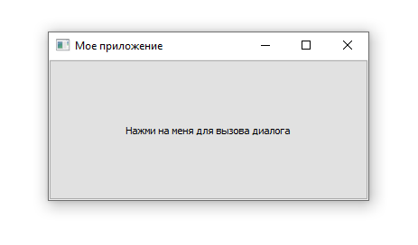
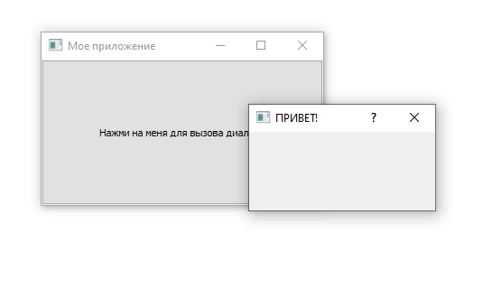
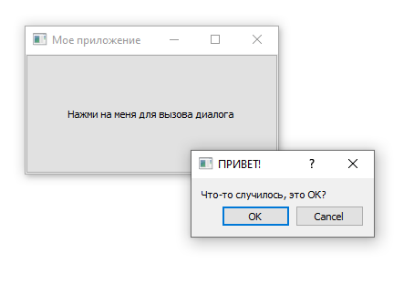
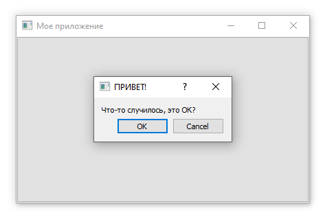
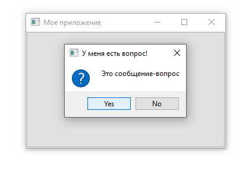
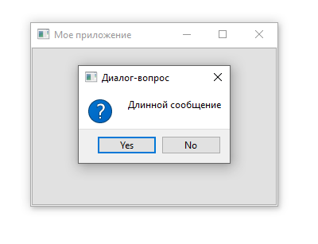
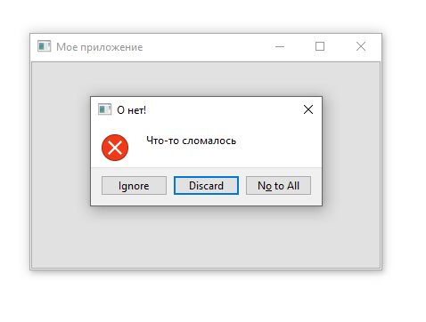

# Лекция №5

## Диалоги и оповещения

### QDialog

Диалоги - это полезные компоненты графического интерфейса, которые позволяют вам общаться с пользователем (отсюда и название диалога). Они обычно используются для открытия/сохранения файлов, настроек, предпочтений или функций, которые не вписываются в основной пользовательский интерфейс приложения. Это небольшие модальные (или блокирующие) окна, которые находятся перед основным приложением, пока не будут закрыты. Qt предоставляет ряд "специальных" встроенных диалогов для наиболее распространенных случаев использования, что позволяет вам обеспечить взаимодействие с пользователем на платформе.

В Qt диалоговые окна обрабатываются классом `QDialog`. Чтобы создать новое диалоговое окно, просто создайте новый объект типа `QDialog`, передав его другому виджету, например `QMainWindow`, как его родитель.

Давайте создадим наш собственный `QDialog`. Мы начнем с простого каркасного приложения с кнопкой для нажатия, подключенной к методу слота.

```python
import PySide2.QtWidgets as psqw

class MainWindow(psqw.QMainWindow):
    def __init__(self):
        super().__init__()

        self.setWindowTitle("Мое приложение")

        button = psqw.QPushButton("Нажми на меня для вызова диалога")
        button.clicked.connect(self.button_clicked)
        self.setCentralWidget(button)

    def button_clicked(self, s):
        print("Клик", s)

app = psqw.QApplication()

window = MainWindow()
window.show()

app.exec_()
```



В слоте `button_clicked` (который получает сигнал от нажатия кнопки) мы создаем экземпляр диалога, передавая наш экземпляр `QMainWindow` в качестве родителя. Это сделает диалог модальным окном `QMainWindow`. Это означает, что диалог полностью блокирует взаимодействие с родительским окном.

```python
import PySide2.QtWidgets as psqw

class MainWindow(psqw.QMainWindow):
    def __init__(self):
        super().__init__()

        self.setWindowTitle("Мое приложение")

        button = psqw.QPushButton("Нажми на меня для вызова диалога")
        button.clicked.connect(self.button_clicked)
        self.setCentralWidget(button)

    def button_clicked(self, s):
        print("Клик", s)

        dlg = psqw.QDialog(self)
        dlg.setWindowTitle("ПРИВЕТ!")
        dlg.exec_()

app = psqw.QApplication()

window = MainWindow()
window.show()

app.exec_()
```



Как только мы создали диалоговое окно, мы запускаем его с помощью `exec_` - точно так же, как мы делали это для `QApplication`, чтобы создать основной цикл обработки событий нашего приложения. Это не совпадение: когда вы запускаете `QDialog`, создается совершенно новый цикл обработки событий, специфичный для диалога.

Как и наше самое первое окно, это не очень интересно. Давайте исправим это, добавив заголовок диалога и набор кнопок "ОК" и "Отмена", чтобы пользователь мог принять или отклонить модальное окно.

Чтобы настроить `QDialog`, мы можем создать его подкласс.

```python
import PySide2.QtWidgets as psqw

class CustomDialog(psqw.QDialog):
    def __init__(self):
        super().__init__()

        self.setWindowTitle("ПРИВЕТ!")

        QBtn = psqw.QDialogButtonBox.Ok | psqw.QDialogButtonBox.Cancel

        self.buttonBox = psqw.QDialogButtonBox(QBtn)
        self.buttonBox.accepted.connect(self.accept)
        self.buttonBox.rejected.connect(self.reject)

        self.layout = psqw.QVBoxLayout()
        message = psqw.QLabel("Что-то случилось, это ОК?")
        self.layout.addWidget(message)
        self.layout.addWidget(self.buttonBox)
        self.setLayout(self.layout)

class MainWindow(psqw.QMainWindow):
    def __init__(self):
        super().__init__()

        self.setWindowTitle("Мое приложение")

        button = psqw.QPushButton("Нажми на меня для вызова диалога")
        button.clicked.connect(self.button_clicked)
        self.setCentralWidget(button)

    def button_clicked(self, s):
        print("Клик", s)

        dlg = CustomDialog()
        dlg.exec_()

app = psqw.QApplication()

window = MainWindow()
window.show()

app.exec_()
```



В приведенном выше коде мы сначала создаем наш подкласс `QDialog`, который мы назвали `CustomDialog`. Что касается `QMainWindow`, мы применяем наши настройки в блоке класса `init`, поэтому наши настройки применяются при создании объекта. Сначала мы устанавливаем заголовок для `QDialog`, используя `setWindowTitle`, точно так же, как мы делали для нашего главного окна.

Следующий блок кода связан с созданием и отображением диалоговых кнопок. Это, вероятно, немного сложнее, чем вы ожидали. Однако это связано с гибкостью Qt в обработке расположения кнопок диалога на разных платформах.

Первым шагом в создании диалогового окна кнопок является определение отображаемых кнопок с использованием атрибутов пространства имен из `QDialogButtonBox`. Полный список доступных кнопок приведен ниже:

- `QDialogButtonBox.Ok`
- `QDialogButtonBox.Open`
- `QDialogButtonBox.Save`
- `QDialogButtonBox.Cancel`
- `QDialogButtonBox.Close`
- `QDialogButtonBox.Discard`
- `QDialogButtonBox.Apply`
- `QDialogButtonBox.Reset`
- `QDialogButtonBox.RestoreDefaults`
- `QDialogButtonBox.Help`
- `QDialogButtonBox.SaveAll`
- `QDialogButtonBox.Yes`
- `QDialogButtonBox.YesToAll`
- `QDialogButtonBox.No`
- `QDialogButtonBox.Abort`
- `QDialogButtonBox.Retry`
- `QDialogButtonBox.Ignore`
- `QDialogButtonBox.NoButton`

Этого должно быть достаточно для создания любого диалогового окна, о котором вы только можете подумать. Вы можете построить линию из нескольких кнопок, соединив их вместе с помощью вертикальной черты (`|`). Qt обработает запрос автоматически в соответствии со стандартами платформы. Например, чтобы отобразить кнопки "ОК" и "Отмена", мы использовали:

```python
QBtn = psqw.QDialogButtonBox.Ok | psqw.QDialogButtonBox.Cancel
```

Переменные кнопки теперь содержат целочисленное значение, представляющее эти две кнопки. Далее мы должны создать экземпляр `QDialogButtonBox` для хранения кнопок. Флаг отображаемых кнопок передается в качестве первого параметра.

Чтобы кнопки имели какой-либо эффект, вы должны подключить правильные сигналы `QDialogButtonBox` к слотам в диалоговом окне. В нашем случае мы связали сигналы `accepted` и `rejected` из `QDialogButtonBox` с обработчиками `accept` и `reject` в нашем подклассе `QDialog`.

Наконец, чтобы `QDialogButtonBox` появился в нашем диалоговом окне, мы должны добавить его в макет диалога. Итак, что касается главного окна, мы создаем макет и добавляем в него наш `QDialogButtonBox`, а затем устанавливаем этот макет в нашем диалоге.

Наконец, мы запускаем `CustomDialog` в нашем слоте `MainWindow.button_clicked`.

Когда вы нажимаете кнопку для запуска диалогового окна, вы можете заметить, что оно появляется вдали от родительского окна - возможно, в центре экрана. Обычно вы хотите, чтобы диалоговые окна появлялись над их окном запуска, чтобы пользователям было легче их найти. Для этого нам нужно дать Qt родителя для диалога. Если мы передаем наше главное окно в качестве родителя, Qt расположит новый диалог так, чтобы центр диалога совпадал с центром окна.

Мы можем изменить наш класс `CustomDialog`, чтобы он принимал родительский параметр.

```python
import PySide2.QtWidgets as psqw

class CustomDialog(psqw.QDialog):
    def __init__(self, parent=None):
        super().__init__(parent)

        self.setWindowTitle("ПРИВЕТ!")

        QBtn = psqw.QDialogButtonBox.Ok | psqw.QDialogButtonBox.Cancel

        self.buttonBox = psqw.QDialogButtonBox(QBtn)
        self.buttonBox.accepted.connect(self.accept)
        self.buttonBox.rejected.connect(self.reject)

        self.layout = psqw.QVBoxLayout()
        message = psqw.QLabel("Что-то случилось, это ОК?")
        self.layout.addWidget(message)
        self.layout.addWidget(self.buttonBox)
        self.setLayout(self.layout)

class MainWindow(psqw.QMainWindow):
    def __init__(self):
        super().__init__()

        self.setWindowTitle("Мое приложение")

        button = psqw.QPushButton("Нажми на меня для вызова диалога")
        button.clicked.connect(self.button_clicked)
        self.setCentralWidget(button)

    def button_clicked(self, s):
        print("Клик", s)

        dlg = CustomDialog(self)
        dlg.exec_()

app = psqw.QApplication()

window = MainWindow()
window.show()

app.exec_()
```



Поздравляем! Вы создали свое первое диалоговое окно. Конечно, вы можете продолжать добавлять любое другое содержимое в диалоговое окно, которое вам нравится. Просто вставьте его в макет как обычно.

### QMessageBox

Есть много диалогов, которые следуют простому шаблону, который мы только что видели - сообщение с кнопками, с помощью которых вы можете принять или отменить диалог. Хотя вы можете создавать эти диалоги самостоятельно, Qt также предоставляет встроенный класс диалогов сообщений, который называется `QMessageBox`. Это можно использовать для создания информационных, предупреждающих, диалоговых окон или диалоговых окон с вопросами.

Пример ниже создает простой `QMessageBox` и показывает его.

```python
import PySide2.QtWidgets as psqw

class CustomDialog(psqw.QDialog):
    def __init__(self, parent=None):
        super().__init__(parent)

        self.setWindowTitle("ПРИВЕТ!")

        QBtn = psqw.QDialogButtonBox.Ok | psqw.QDialogButtonBox.Cancel

        self.buttonBox = psqw.QDialogButtonBox(QBtn)
        self.buttonBox.accepted.connect(self.accept)
        self.buttonBox.rejected.connect(self.reject)

        self.layout = psqw.QVBoxLayout()
        message = psqw.QLabel("Что-то случилось, это ОК?")
        self.layout.addWidget(message)
        self.layout.addWidget(self.buttonBox)
        self.setLayout(self.layout)

class MainWindow(psqw.QMainWindow):
    def __init__(self):
        super().__init__()

        self.setWindowTitle("Мое приложение")

        button = psqw.QPushButton("Нажми на меня для вызова диалога")
        button.clicked.connect(self.button_clicked)
        self.setCentralWidget(button)

    def button_clicked(self, s):
        dlg = psqw.QMessageBox(self)
        dlg.setWindowTitle("У меня есть вопрос!")
        dlg.setText("Это простой диалог")
        button = dlg.exec_()

        if button == psqw.QMessageBox.Ok:
            print("ОК!")

app = psqw.QApplication()

window = MainWindow()
window.show()

app.exec_()
```


Как и в случае с диалоговым окном кнопок, которое мы уже рассмотрели, кнопки, показанные в `QMessageBox`, также настроены с набором констант, которые можно комбинировать с (`|`), чтобы отобразить несколько кнопок. Полный список доступных типов кнопок показан ниже:

- `QMessageBox.Ok`
- `QMessageBox.Open`
- `QMessageBox.Save`
- `QMessageBox.Cancel`
- `QMessageBox.Close`
- `QMessageBox.Discard`
- `QMessageBox.Apply`
- `QMessageBox.Reset`
- `QMessageBox.RestoreDefaults`
- `QMessageBox.Help`
- `QMessageBox.SaveAll`
- `QMessageBox.Yes`
- `QMessageBox.YesToAll`
- `QMessageBox.No`
- `QMessageBox.NoToAll`
- `QMessageBox.Abort`
- `QMessageBox.Retry`
- `QMessageBox.Ignore`
- `QMessageBox.NoButton`

Вы также можете настроить значок, отображаемый в диалоговом окне, установив значок одним из следующих способов:

| QMessageBox.NoIcon | Без иконки |
| --- | --- |
| QMessageBox.Question | Сообщение задает вопрос |
| QMessageBox.Information | Сообщение несет в себе информацию |
| QMessageBox.Warning | Сообщение-предупреждение |
| QMessageBox.Critical | Сообщение говорит о критической ошибке |

Например, следующее создает диалоговое окно вопроса с кнопками "Да" и "Нет".

```python
import PySide2.QtWidgets as psqw

class CustomDialog(psqw.QDialog):
    def __init__(self, parent=None):
        super().__init__(parent)

        self.setWindowTitle("ПРИВЕТ!")

        QBtn = psqw.QDialogButtonBox.Ok | psqw.QDialogButtonBox.Cancel

        self.buttonBox = psqw.QDialogButtonBox(QBtn)
        self.buttonBox.accepted.connect(self.accept)
        self.buttonBox.rejected.connect(self.reject)

        self.layout = psqw.QVBoxLayout()
        message = psqw.QLabel("Что-то случилось, это ОК?")
        self.layout.addWidget(message)
        self.layout.addWidget(self.buttonBox)
        self.setLayout(self.layout)

class MainWindow(psqw.QMainWindow):
    def __init__(self):
        super().__init__()

        self.setWindowTitle("Мое приложение")

        button = psqw.QPushButton("Нажми на меня для вызова диалога")
        button.clicked.connect(self.button_clicked)
        self.setCentralWidget(button)

    def button_clicked(self, s):
        dlg = psqw.QMessageBox(self)
        dlg.setWindowTitle("У меня есть вопрос!")
        dlg.setText("Это сообщение-вопрос")
        dlg.setStandardButtons(psqw.QMessageBox.Yes | psqw.QMessageBox.No)
        dlg.setIcon(psqw.QMessageBox.Question)
        button = dlg.exec_()

        if button == psqw.QMessageBox.Yes:
            print("Да!")
        else:
            print("Нет!")

app = psqw.QApplication()

window = MainWindow()
window.show()

app.exec_()
```



### Встроенные диалоги QMessageBox

Чтобы сделать вещи еще проще, в `QMessageBox` есть ряд методов, которые можно использовать для создания диалогов сообщений такого типа. Эти методы показаны ниже:

```python
QMessageBox.about(parent, title, message)
QMessageBox.critical(parent, title, message)
QMessageBox.information(parent, title, message)
QMessageBox.question(parent, title, message)
QMessageBox.warning(parent, title, message)
```

Родительский параметр - это окно, дочерним элементом которого будет диалоговое окно. Если вы запускаете свой диалог из главного окна, вы можете просто перейти в `self`. В следующем примере создается диалоговое окно вопроса, как и прежде, с кнопками "Да" и "Нет":

```python
import PySide2.QtWidgets as psqw

class CustomDialog(psqw.QDialog):
    def __init__(self, parent=None):
        super().__init__(parent)

        self.setWindowTitle("ПРИВЕТ!")

        QBtn = psqw.QDialogButtonBox.Ok | psqw.QDialogButtonBox.Cancel

        self.buttonBox = psqw.QDialogButtonBox(QBtn)
        self.buttonBox.accepted.connect(self.accept)
        self.buttonBox.rejected.connect(self.reject)

        self.layout = psqw.QVBoxLayout()
        message = psqw.QLabel("Что-то случилось, это ОК?")
        self.layout.addWidget(message)
        self.layout.addWidget(self.buttonBox)
        self.setLayout(self.layout)

class MainWindow(psqw.QMainWindow):
    def __init__(self):
        super().__init__()

        self.setWindowTitle("Мое приложение")

        button = psqw.QPushButton("Нажми на меня для вызова диалога")
        button.clicked.connect(self.button_clicked)
        self.setCentralWidget(button)

    def button_clicked(self, s):
        button = psqw.QMessageBox.question(self, "Диалог-вопрос", "Длинной сообщение")

        if button == psqw.QMessageBox.Yes:
            print("Yes!")
        else:
            print("No!")

app = psqw.QApplication()

window = MainWindow()
window.show()

app.exec_()
```



Обратите внимание, что вместо вызова `exec` мы теперь просто вызываем метод диалога, и диалог создается. Возвращаемое значение каждого из методов - это нажатая кнопка. Мы можем определить, что было нажато, сравнивая возвращаемое значение с константами кнопки.

Четыре метода информации, вопроса, предупреждения и критического состояния также принимают необязательные кнопки и аргументы `defaultButton`, которые можно использовать для настройки кнопок, отображаемых в диалоговом окне, и выбора одной из них по умолчанию. Как правило, вы не хотите менять это значение по умолчанию.

```python
import PySide2.QtWidgets as psqw

class CustomDialog(psqw.QDialog):
    def __init__(self, parent=None):
        super().__init__(parent)

        self.setWindowTitle("ПРИВЕТ!")

        QBtn = psqw.QDialogButtonBox.Ok | psqw.QDialogButtonBox.Cancel

        self.buttonBox = psqw.QDialogButtonBox(QBtn)
        self.buttonBox.accepted.connect(self.accept)
        self.buttonBox.rejected.connect(self.reject)

        self.layout = psqw.QVBoxLayout()
        message = psqw.QLabel("Что-то случилось, это ОК?")
        self.layout.addWidget(message)
        self.layout.addWidget(self.buttonBox)
        self.setLayout(self.layout)

class MainWindow(psqw.QMainWindow):
    def __init__(self):
        super().__init__()

        self.setWindowTitle("Мое приложение")

        button = psqw.QPushButton("Нажми на меня для вызова диалога")
        button.clicked.connect(self.button_clicked)
        self.setCentralWidget(button)

    def button_clicked(self, s):
        button = psqw.QMessageBox.critical(
            self,
            "О нет!",
            "Что-то сломалось",
            buttons=psqw.QMessageBox.Discard | psqw.QMessageBox.NoToAll | psqw.QMessageBox.Ignore,
            defaultButton=psqw.QMessageBox.Discard
        )

        if button == psqw.QMessageBox.Discard:
            print("Discard!")
        elif button == psqw.QMessageBox.NoToAll:
            print("No to all!")
        else:
            print("Ignore!")

app = psqw.QApplication()

window = MainWindow()
window.show()

app.exec_()
```


