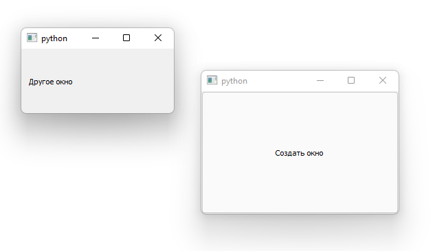
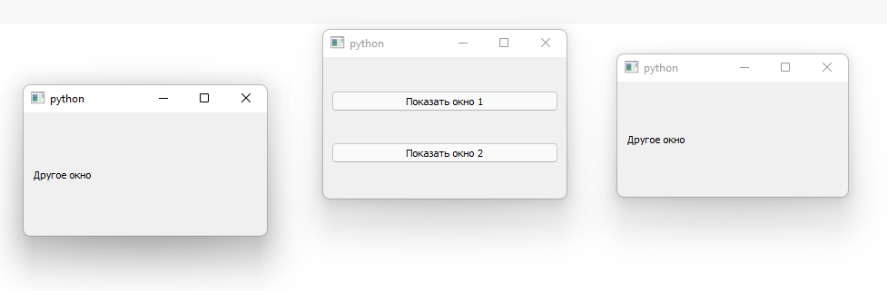

# Лекция №6

## Создание дополнительных окон

В предыдущем уроке мы уже рассмотрели, как открывать диалоговые окна. Это специальные окна, которые (по умолчанию) захватывают внимание пользователя и запускают собственный цикл событий, эффективно блокируя выполнение остальной части вашего приложения.

Однако довольно часто вам потребуется открыть второе окно в приложении, не прерывая основное окно, например, чтобы показать результат какого-то длительного процесса или отобразить графики или другие визуализации. В качестве альтернативы вы можете создать приложение, позволяющее работать с несколькими документами одновременно в их собственных окнах.

Открывать новые окна относительно просто, но есть несколько вещей, о которых следует помнить, чтобы убедиться, что они работают правильно. В этом руководстве мы рассмотрим, как создать новое окно и как отображать и скрывать внешние окна по требованию.

### Создание нового окна

В Qt любой виджет без родителя является окном. Это означает, что для отображения нового окна вам просто нужно создать новый экземпляр виджета. Это может быть любой тип виджета (технически любой подкласс `QWidget`), включая другой `QMainWindow`, если вы предпочитаете.

```python
import PySide2.QtWidgets as psqw
import PySide2.QtCore as psqc
import PySide2.QtGui as psqg

class AnotherWindow(psqw.QWidget):
    def __init__(self):
        super().__init__()
        layout = psqw.QVBoxLayout()
        self.label = psqw.QLabel("Другое окно")
        layout.addWidget(self.label)
        self.setLayout(layout)

class MainWindow(psqw.QMainWindow):
    def __init__(self):
        super().__init__()
        self.button = psqw.QPushButton("Создать окно")
        self.button.clicked.connect(self.show_new_window)
        self.setCentralWidget(self.button)

    def show_new_window(self, checked):
        self.w = AnotherWindow()
        self.w.show()

app = psqw.QApplication()
w = MainWindow()
w.show()
app.exec_()
```



Однако что произойдет, если вы снова нажмете кнопку? Окно будет создано заново! Это новое окно заменит старое в переменной self.w, и поскольку теперь на него нет ссылки - предыдущее окно будет уничтожено.

Вы можете увидеть это в действии, если измените определение окна, чтобы отображать случайное число в метке каждый раз, когда оно создается.

Одно из решений состоит в том, чтобы просто проверить, было ли окно уже создано перед его созданием. Пример ниже показывает это в действии.

```python
import PySide2.QtWidgets as psqw
import PySide2.QtCore as psqc
import PySide2.QtGui as psqg

class AnotherWindow(psqw.QWidget):
    def __init__(self):
        super().__init__()
        layout = psqw.QVBoxLayout()
        self.label = psqw.QLabel("Другое окно")
        layout.addWidget(self.label)
        self.setLayout(layout)

class MainWindow(psqw.QMainWindow):
    def __init__(self):
        super().__init__()
        self.w = None
        self.button = psqw.QPushButton("Создать окно")
        self.button.clicked.connect(self.show_new_window)
        self.setCentralWidget(self.button)

    def show_new_window(self, checked):
        if self.w is None:
            self.w = AnotherWindow()
        self.w.show()

app = psqw.QApplication()
w = MainWindow()
w.show()
app.exec_()
```

Используя кнопку, вы можете открыть окно и использовать элементы управления окном, чтобы закрыть его. Если вы снова нажмете кнопку, снова появится то же самое окно.

Этот подход подходит для окон, которые вы создаете временно, например, если вы хотите, чтобы всплывающее окно отображало конкретный график или вывод журнала. Однако для многих приложений у вас есть ряд стандартных окон, которые вы хотите показывать/скрывать по требованию.

В следующей части мы рассмотрим, как работать с этими типами окон.

### Переключение окна

Часто вам потребуется переключить отображение окна с помощью действия на панели инструментов или в меню. Как мы видели ранее, если ссылка на окно не сохранена, оно будет отброшено (и закрыто). Мы можем использовать это поведение, чтобы закрыть окно, заменив метод `show_new_window`

```python
import PySide2.QtWidgets as psqw
import PySide2.QtCore as psqc
import PySide2.QtGui as psqg

class AnotherWindow(psqw.QWidget):
    def __init__(self):
        super().__init__()
        layout = psqw.QVBoxLayout()
        self.label = psqw.QLabel("Другое окно")
        layout.addWidget(self.label)
        self.setLayout(layout)

class MainWindow(psqw.QMainWindow):
    def __init__(self):
        super().__init__()
        self.w = None
        self.button = psqw.QPushButton("Создать окно")
        self.button.clicked.connect(self.show_new_window)
        self.setCentralWidget(self.button)

    def show_new_window(self, checked):
        if self.w is None:
            self.w = AnotherWindow()
            self.w.show()
        else:
            self.w = None

app = psqw.QApplication()
w = MainWindow()
w.show()
app.exec_()
```

При установке для `self.w` значения `None` ссылка на окно будет потеряна, и окно закроется.

Это будет работать только в том случае, если вы не сохранили ссылку на это окно в другом месте. Чтобы убедиться, что окно закрывается в любом случае, вы можете явно вызвать для него `close`. Полный пример показан ниже.

```python
import PySide2.QtWidgets as psqw
import PySide2.QtCore as psqc
import PySide2.QtGui as psqg

class AnotherWindow(psqw.QWidget):
    def __init__(self):
        super().__init__()
        layout = psqw.QVBoxLayout()
        self.label = psqw.QLabel("Другое окно")
        layout.addWidget(self.label)
        self.setLayout(layout)

class MainWindow(psqw.QMainWindow):
    def __init__(self):
        super().__init__()
        self.w = None
        self.button = psqw.QPushButton("Создать окно")
        self.button.clicked.connect(self.show_new_window)
        self.setCentralWidget(self.button)

    def show_new_window(self, checked):
        if self.w is None:
            self.w = AnotherWindow()
            self.w.show()
        else:
            self.w.close()
            self.w = None

app = psqw.QApplication()
w = MainWindow()
w.show()
app.exec_()
```

### Постоянные окна

До сих пор мы рассматривали, как создавать новые окна по запросу. Однако иногда у вас есть ряд стандартных окон приложений. В этом случае вместо того, чтобы создавать окна, когда вы хотите их показать, часто имеет смысл создавать их при запуске, а затем использовать `show` для их отображения при необходимости.

В следующем примере мы создаем наше внешнее окно в блоке `init` для главного окна, а затем наш метод `show_new_window` просто вызывает `self.w.show` для его отображения.

```python
import PySide2.QtWidgets as psqw
import PySide2.QtCore as psqc
import PySide2.QtGui as psqg

class AnotherWindow(psqw.QWidget):
    def __init__(self):
        super().__init__()
        layout = psqw.QVBoxLayout()
        self.label = psqw.QLabel("Другое окно")
        layout.addWidget(self.label)
        self.setLayout(layout)

class MainWindow(psqw.QMainWindow):
    def __init__(self):
        super().__init__()
        self.w = AnotherWindow()
        self.button = psqw.QPushButton("Создать окно")
        self.button.clicked.connect(self.show_new_window)
        self.setCentralWidget(self.button)

    def show_new_window(self, checked):
        self.w.show()

app = psqw.QApplication()
w = MainWindow()
w.show()
app.exec_()
```

Если вы запустите это, нажатие на кнопку покажет окно, как и раньше. Однако обратите внимание, что окно создается только один раз, и вызов `show` для уже видимого окна не имеет никакого эффекта.

### Отображение и скрытие постоянных окон

Создав постоянное окно, вы можете отображать и скрывать его, не создавая его заново. После того, как окно скрыто, оно все еще существует, но не будет видно и не будет принимать любой ввод. Однако вы можете продолжать вызывать методы окна и обновлять его состояние, в том числе изменять его внешний вид. После повторного показа любые изменения будут видны.

Ниже мы обновляем наше главное окно, чтобы создать метод `toggle_window`, который проверяет с помощью `isVisible`, видимо ли окно в данный момент. Если это не так, он отображается с помощью `show` , если он уже виден, мы скрываем его с помощью `hide`.

```python
import PySide2.QtWidgets as psqw
import PySide2.QtCore as psqc
import PySide2.QtGui as psqg

class AnotherWindow(psqw.QWidget):
    def __init__(self):
        super().__init__()
        layout = psqw.QVBoxLayout()
        self.label = psqw.QLabel("Другое окно")
        layout.addWidget(self.label)
        self.setLayout(layout)

class MainWindow(psqw.QMainWindow):
    def __init__(self):
        super().__init__()
        self.w = AnotherWindow()
        self.button = psqw.QPushButton("Создать окно")
        self.button.clicked.connect(self.toggle_window)
        self.setCentralWidget(self.button)

    def toggle_window(self, checked):
        if self.w.isVisible():
            self.w.hide()
        else:
            self.w.show()

app = psqw.QApplication()
w = MainWindow()
w.show()
app.exec_()
```

### Несколько окон

Вы можете использовать тот же принцип для создания нескольких окон - пока вы сохраняете ссылку на окно, все будет работать так, как ожидалось. Самый простой подход - создать отдельный метод для переключения отображения каждого из окон.

```python
import PySide2.QtWidgets as psqw
import PySide2.QtCore as psqc
import PySide2.QtGui as psqg

class AnotherWindow(psqw.QWidget):
    def __init__(self):
        super().__init__()
        layout = psqw.QVBoxLayout()
        self.label = psqw.QLabel("Другое окно")
        layout.addWidget(self.label)
        self.setLayout(layout)

class MainWindow(psqw.QMainWindow):
    def __init__(self):
        super().__init__()
        self.window1 = AnotherWindow()
        self.window2 = AnotherWindow()

        l = psqw.QVBoxLayout()
        button1 = psqw.QPushButton("Показать окно 1")
        button1.clicked.connect(self.toggle_window1)
        l.addWidget(button1)

        button2 = psqw.QPushButton("Показать окно 2")
        button2.clicked.connect(self.toggle_window2)
        l.addWidget(button2)

        w = psqw.QWidget()
        w.setLayout(l)
        self.setCentralWidget(w)

    def toggle_window1(self, checked):
        if self.window1.isVisible():
            self.window1.hide()

        else:
            self.window1.show()

    def toggle_window2(self, checked):
        if self.window2.isVisible():
            self.window2.hide()

        else:
            self.window2.show()

app = psqw.QApplication()
w = MainWindow()
w.show()
app.exec_()
```


