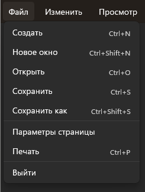
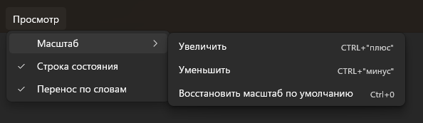

# Лабораторная работа №4

## Задание №1

Создайте приложение с любыми настройками окна. Добавьте в приложение панель инструментов. В панели инструментов должно быть несколько кнопок с иконками, при нажатии на которые, в окне приложения будет добавляться виджет, соответствующий этой кнопке. Все виджеты должны добавляться в макет. Количество кнопок (не менее 5), иконки, виджеты и макет Вы определяете самостоятельно. Назначьте кнопкам любые горячие клавиши.

## Задание №2

В ранее созданной приложение добавьте несколько меню:

+ В первом меню будут дублированы все кнопки с панели инструментов
+ Второе меню реализуйте по данному примеру:

Действия для кнопок назначать не нужно, кроме кнопки `Выйти`, при нажатии на которую, приложение закроется.

+ Третье меню реализуйте по данному примеру:

На кнопки `увеличить` и `уменьшить` необходимо назначить горячие клавиши `+` и `-`. При нажатии на них текущий размер окна должен увеличиваться и уменьшаться соответственно на 10 пунктов (lля получения текущего размера окна можно вызвать метод `size`).