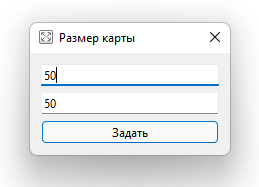

# Лабораторная работа №6

## Задание №1

Создайте приложение с любыми настройками окна. Внутри окна будет поле из кнопок (как в лабораторной №3). По умолчанию окно создается с заданным вами количеством кнопок. Также в окне должна присутствовать кнопка, при нажатии на которую основное окно закроется и откроется новое согласно примеру:

В этом окне должно быть два поля для ввода, которые определяют количество кнопок в поле кнопок (например, 30x30 2x100), и кнопка, при нажатии на которую, вновь открывается основное окно, но количество кнопок в нем должно измениться на те параметры, которые были указаны в дополнительном окне.

При нажатии на любую кнопку из поля кнопок, должно создаться новое окно (при этом основное не закрывается) в котором будет расположен любой случайный виджет. Заголовок этого окна должен быть названием соответствующего виджета.
