# Создаём первое приложение на Qt

## Создание приложения

Создадим первое приложение. Для начала необходимо создать python файл и с любым названием (в примерах будет именоваться как ```main.py```). Внутри файла записываем следующий код:
```python
import PySide2.QtWidgets as psqw

app = psqw.QApplication()

window = psqw.QWidget()
window.show()

app.exec_()
```

Теперь запустим приложение. Сделать это можно через консоль с помощью команды:
```python
python main.py
```
или средствами вашей среды разработки. После запуска откроется окно нашего приложения. ```Qt``` автоматически создаст окно размером, оптимальным для вашего экрана.

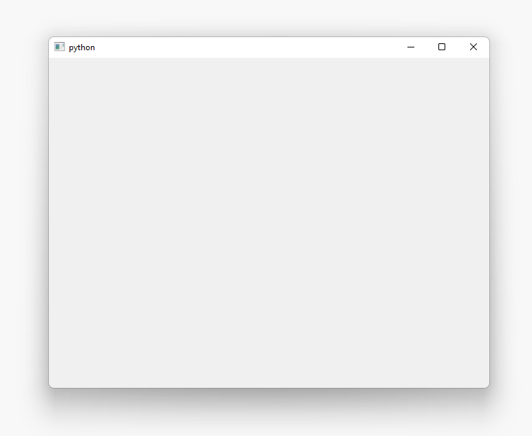

### Разбор кода из примера выше

Первым делом мы импортируем один из основных модулей ```Qt``` модуль `PySide2.QtWidgets` в котором имеются классы нужные для приложения:

```python
import PySide2.QtWidgets as psqw
```

Вы можете подключать модули как используя ```import <module>```, так и ```from <module> import``` в зависимости от ваших личных предпочтений.

Затем создаём экземпляр приложения ```QApplication```:

```python
app = psqw.QApplication()
```

Далее создаём экземпляр виджета ```QWidget``` и даём ему имя ```window```. В ```Qt``` все виджеты верхнего уровня являются окнами, то есть они не имеют родителя и не вложены в другой виджет или макет. Это означает, что технически вы можете создать окно, используя любой виджет, который вам нравится.

```python
window = psqw.QWidget()
window.show()
```

> Виджеты без родителя по умолчанию невидимы. Поэтому после создания объекта окна мы всегда должны вызывать у него метод ```show```, чтобы сделать его видимым.

Наконец, мы вызываем у приложения метод ```exec_``` для запуска цикла событий:

```python
app.exec_()
```

## Событийный цикл

Прежде чем вывести окно на экран, необходимо представить несколько ключевых концепций организации приложений в мире ```Qt```.

Ядром каждого приложения ```Qt``` является класс ```QApplication```. Каждому приложению для работы нужен один и только один объект ```QApplication```. Этот объект содержит цикл событий вашего приложения - основной цикл, который управляет всем взаимодействием пользователя с графическим интерфейсом.

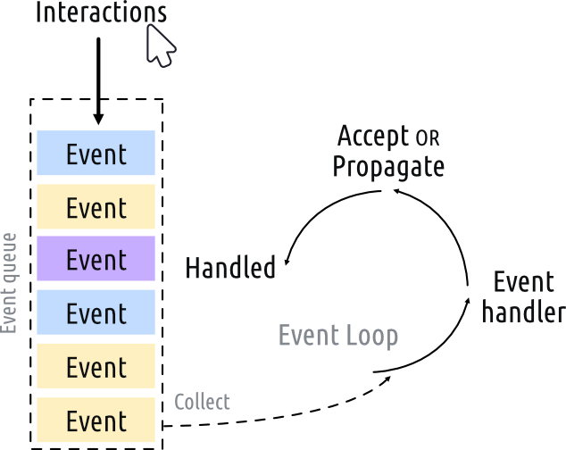

Каждое взаимодействие (interaction) с вашим приложением, будь то нажатие клавиши, щелчок мышью или движение мыши, генерирует событие (event), которое помещается в очередь событий (event queue). В цикле событий очередь проверяется на каждой итерации, и если ожидающее событие найдено, событие и управление передаются конкретному обработчику событий (event handler) для этого события. Обработчик событий обрабатывает событие, а затем передает управление обратно в цикл обработки событий, чтобы дождаться новых событий. Для каждого приложения существует только один цикл обработки событий.

> Класс ```QApplication``` содержит цикл событий ```Qt```. Требуется только один экземпляр ```QApplication``` в вашем приложении.

## QMainWindow

Как мы выяснили ранее, в ```Qt``` любые виджеты могут быть окнами. Например, если вы замените ```QtWidget``` на ```QPushButton```, то вы получите окно с одной нажимаемой кнопкой:

```python
import PySide2.QtWidgets as psqw

app = psqw.QApplication()

window = psqw.QPushButton('Нажми меня')
window.show()

app.exec_()
```

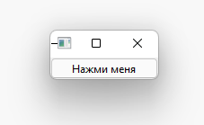)

Это удобно, но не очень полезно - редко когда вам нужен пользовательский интерфейс, состоящий только из одного элемента управления. Но, как мы узнаем позже, возможность вкладывать виджеты в другие виджеты с помощью макетов означает, что вы можете создавать сложные пользовательские интерфейсы внутри пустого ```QWidget```.

Но у ```Qt``` уже есть решение для вас - ```QMainWindow```. Это готовый виджет, который предоставляет множество стандартных оконных функций, которые вы будете использовать в своих приложениях, включая панели инструментов, меню, строку состояния, закрепляемые виджеты и многое другое. Добавим в наше приложение простое пустое окно ```QMainWindow```:

```python
import PySide2.QtWidgets as psqw

app = psqw.QApplication()

window = psqw.QMainWindow()
window.show()

app.exec_()
```

После запуска видим, что мы получаем такое же окно, как и ранее (но меньшего размера).


Если вы хотите создать собственное окно, лучше всего создать подкласс ```QMainWindow```, а затем включить настройку окна в блок ```__init__```. Это позволяет сделать поведение окна автономным. Добавим собственный подкласс ```QMainWindow``` и назовем его ```MainWindow```:

```python
import PySide2.QtWidgets as psqw
import PySide2.QtCore as psqc

class MainWindow(psqw.QMainWindow):
    def __init__(self):
        super().__init__()

        self.setWindowTitle('Мое приложение')

        button = psqw.QPushButton('Нажми на меня!')

        self.setCentralWidget(button)

app = psqw.QApplication()

window = MainWindow()
window.show()

app.exec_()
```

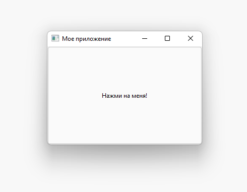

Для этой демонстрации мы используем ```QPushButton```. Основные виджеты ```Qt``` всегда импортируются из пространства имен ```QtWidgets```, как и классы ```QMainWindow``` и ```QApplication```. При использовании ```QMainWindow``` мы используем ```setCentralWidget``` для размещения виджета (в данном примере ```QPushButton```) в ```QMainWindow```,где он по умолчанию занимает все окно.

> Когда вы создаете подкласс класса Qt, вы всегда должны вызывать ```super().__init__```, чтобы позволить ```Qt``` настроить объект.


В нашем блоке ```__init__``` мы сначала используем ```setWindowTitle```, чтобы изменить заголовок нашего главного окна. Затем мы добавляем наш первый виджет ```QPushButton``` в середину окна. Это один из основных виджетов, доступных в ```Qt```. При создании кнопки вы можете передать текст, который вы хотите, чтобы кнопка его отображала.

Наконец, мы вызываем ```setCentralWidget``` для окна. Это специальная функция ```QMainWindow```, которая позволяет вам установить виджет, который будет располагается в середине окна.

## Изменение размеров окон и виджетов

В настоящее время размер окна можно свободно изменять - если вы захватите любой угол мышью, вы можете перетащить его и изменить его размер до любого желаемого размера. Хотя это хорошо, чтобы ваши пользователи могут изменять размер ваших приложений, иногда вы можете захотеть установить ограничения на минимальный или максимальный размер или заблокировать окно до фиксированного размера.

В ```Qt``` размеры определяются с помощью объекта ```QSize```. Он принимает параметры ширины и высоты в указанном порядке. Например, следующий пример создаст окно фиксированного размера 800x600 пикселей:

```python
import PySide2.QtWidgets as psqw
import PySide2.QtCore as psqc

class MainWindow(psqw.QMainWindow):
    def __init__(self):
        super().__init__()

        self.setWindowTitle('Мое приложение')

        button = psqw.QPushButton('Нажми на меня!')

        self.setFixedSize(psqc.QSize(800, 600))

        self.setCentralWidget(button)

app = psqw.QApplication()

window = MainWindow()
window.show()

app.exec_()
```


Помимо ```setFixedSize```, вы также можете вызвать ```setMinimumSize``` и ```setMaximumSize```, чтобы установить минимальный и максимальный размеры соответственно.

> Вы можете использовать эти методы размера для любого виджета.

## Сигналы и слоты

Сигналы - это уведомления, излучаемые виджетами, когда что-то происходит. Этим чем-то может быть любое количество вещей, от нажатия кнопки до изменения текста в поле ввода. Многие сигналы инициируются действием пользователя, но не всегда. В дополнение к уведомлению о том, что что-то происходит, сигналы также могут отправлять данные, чтобы предоставить дополнительный контекст о том, что произошло.

Слоты - это имя, которое ```Qt``` использует для приемников сигналов. В Python любая функция (или метод) в вашем приложении может использоваться как слот, просто подключив к ней сигнал. Если сигнал отправляет данные, то принимающая функция также получит эти данные. Многие виджеты ```Qt``` также имеют свои собственные встроенные слоты, что означает, что вы можете напрямую соединять виджеты ```Qt``` друг с другом.

### QPushButton

Наше простое приложение в настоящее время имеет ```QMainWindow``` с ```QPushButton```, установленным в качестве центрального виджета. Давайте начнем с подключения этой кнопки к пользовательскому методу Python. Здесь мы создаем простой пользовательский слот с именем ```the_button_was_clicked```, который принимает сигнал щелчка от ```QPushButton```.

```python
import PySide2.QtWidgets as psqw
import PySide2.QtCore as psqc

class MainWindow(psqw.QMainWindow):
    def __init__(self):
        super().__init__()

        self.setWindowTitle('Мое приложение')

        button = psqw.QPushButton('Нажми на меня!')
        button.setCheckable(True)
        button.clicked.connect(self.the_button_was_clicked)

        self.setCentralWidget(button)

    def the_button_was_clicked(self):
        print('Нажата!')

app = psqw.QApplication()

window = MainWindow()
window.show()

app.exec_()
```

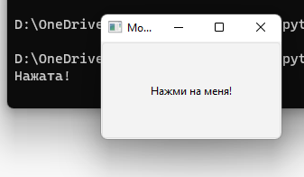

### Получение данных

Мы уже знаем, что сигналы также могут отправлять данные, чтобы предоставить больше информации о том, что только что произошло. Сигнал ```clicked``` не является исключением, так как он также обеспечивает отмеченное (или переключенное) состояние кнопки. Для обычных кнопок это всегда ```False```, поэтому наш первый слот игнорировал эти данные. Однако мы можем сделать нашу кнопку доступной для проверки и увидеть эффект.

```python
import PySide2.QtWidgets as psqw
import PySide2.QtCore as psqc

class MainWindow(psqw.QMainWindow):
    def __init__(self):
        super().__init__()

        self.setWindowTitle('Мое приложение')

        button = psqw.QPushButton('Нажми на меня!')
        button.setCheckable(True)
        button.clicked.connect(self.the_button_was_clicked)
        button.clicked.connect(self.the_button_was_toggled)

        self.setCentralWidget(button)

    def the_button_was_clicked(self):
        print('Нажата!')
    
    def the_button_was_toggled(self, checked):
        print('Нажата?', checked)

app = psqw.QApplication()

window = MainWindow()
window.show()

app.exec_()
```

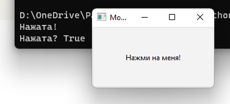

Вы можете подключить к сигналу столько слотов, сколько захотите, и одновременно реагировать на разные версии сигналов на своих слотах.

### Хранение данных

Часто бывает полезно сохранить текущее состояние виджета в переменной Python. Это позволяет вам работать со значениями, как с любой другой переменной Python, и без доступа к исходному виджету. Вы можете сохранить эти значения как отдельные переменные или использовать словарь, если хотите. В следующем примере мы сохраняем проверенное значение нашей кнопки в переменной с именем ```button_is_checked```.

```python
import PySide2.QtWidgets as psqw
import PySide2.QtCore as psqc

class MainWindow(psqw.QMainWindow):
    def __init__(self):
        super().__init__()

        self.button_is_checked = True

        self.setWindowTitle('Мое приложение')

        button = psqw.QPushButton('Нажми на меня!')
        button.setCheckable(True)
        button.clicked.connect(self.the_button_was_toggled)
        button.setChecked(self.button_is_checked)

        self.setCentralWidget(button)
    
    def the_button_was_toggled(self, checked):
        self.button_is_checked = checked
        print(self.button_is_checked)

app = psqw.QApplication()

window = MainWindow()
window.show()

app.exec_()
```

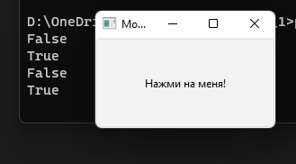

Сначала мы устанавливаем значение по умолчанию для нашей переменной (```True```), затем используем значение по умолчанию для установки начального состояния виджета. Когда состояние виджета изменяется, мы получаем сигнал и обновляем переменную для соответствия.

Вы можете использовать этот же шаблон с любыми виджетами PySide. Если виджет не предоставляет сигнал, который отправляет текущее состояние, вам нужно будет получить значение из виджета непосредственно в вашем обработчике. Например, здесь мы проверяем проверенное состояние в нажатом обработчике.

```python
import PySide2.QtWidgets as psqw
import PySide2.QtCore as psqc

class MainWindow(psqw.QMainWindow):
    def __init__(self):
        super().__init__()

        self.button_is_checked = True

        self.setWindowTitle('Мое приложение')

        button = psqw.QPushButton('Нажми на меня!')
        button.setCheckable(True)
        button.released.connect(self.the_button_was_released)
        button.setChecked(self.button_is_checked)

        self.setCentralWidget(button)
    
    def the_button_was_released(self):
        self.button_is_checked = self.button.isChecked()

app = psqw.QApplication()

window = MainWindow()
window.show()

app.exec_()
```

Сигнал ```released``` срабатывает при отпускании кнопки, но не отправляет состояние проверки, поэтому вместо этого мы используем ```isChecked```, чтобы получить состояние проверки от кнопки в нашем обработчике.

### Изменение интерфейса

До сих пор мы видели, как принимать сигналы и выводить вывод на консоль. Но как насчет того, чтобы что-то происходило в интерфейсе, когда мы нажимаем кнопку? Давайте обновим наш метод слота, чтобы изменить кнопку, изменив текст и отключив кнопку, чтобы она больше не нажималась. Мы также отключим состояние ```checkable``` на данный момент.

```python
import PySide2.QtWidgets as psqw
import PySide2.QtCore as psqc

class MainWindow(psqw.QMainWindow):
    def __init__(self):
        super().__init__()

        self.setWindowTitle('Мое приложение')

        self.button = psqw.QPushButton('Нажми на меня!')
        self.button.clicked.connect(self.the_button_was_clicked)

        self.setCentralWidget(self.button)
    
    def the_button_was_clicked(self):
        self.button.setText('Ты уже нажал на меня')
        self.button.setEnabled(False)

        self.setWindowTitle('Кнопка поменяла название окна')

app = psqw.QApplication()

window = MainWindow()
window.show()

app.exec_()
```

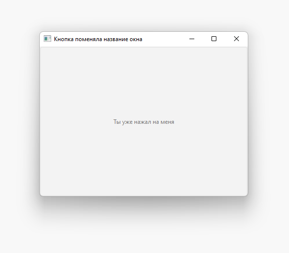

Поскольку нам нужно иметь доступ к кнопке в нашем методе ```the_button_was_clicked```, мы сохраняем ссылку на нее в ```self```. Текст кнопки изменяется передачей ```str``` в ```setText```. Чтобы отключить кнопку, вызовите ```setEnabled``` с ```False```.

Вы не ограничены изменением кнопки, которая запускает сигнал, вы можете делать все, что хотите, в методах слота. В примере выше мы добавили в метод ```the_button_was_clicked``` метод ```setWindowTitle```, чтобы также изменить заголовок окна.

Большинство виджетов имеют свои собственные сигналы, и ```QMainWindow```, который мы используем для нашего окна, не является исключением. В следующем более сложном примере мы подключаем сигнал ```windowTitleChanged``` в ```QMainWindow``` к пользовательскому методу слота.

Мы подключаем сигнал ```windowTitleChanged``` в ```QMainWindow``` к слоту метода ```the_window_title_changed```. Этот слот также получает новый заголовок окна.

```python
import random

import PySide2.QtWidgets as psqw
import PySide2.QtCore as psqc

window_titles = [
    'Мое приложение',
    'Мое приложение',
    'Все еще мое приложение',
    'Все еще мое приложение',
    'Что-то пошло не так'
]

class MainWindow(psqw.QMainWindow):
    def __init__(self):
        super().__init__()

        self.n_times_clicked = 0

        self.setWindowTitle('Мое приложение')

        self.button = psqw.QPushButton('Нажми на меня!')
        self.button.clicked.connect(self.the_button_was_clicked)

        self.windowTitleChanged.connect(self.the_window_title_changed)

        self.setCentralWidget(self.button)
    
    def the_button_was_clicked(self):
        print('Нажата!')
        new_window_title = random.choice(window_titles)
        print(f'Установлено название: {new_window_title}')
        self.setWindowTitle(new_window_title)

    def the_window_title_changed(self, window_title):
        print(f'Название окна изменилось на {window_title}')

        if window_title == 'Что-то пошло не так':
            self.button.setDisabled(True)

app = psqw.QApplication()

window = MainWindow()
window.show()

app.exec_()
```

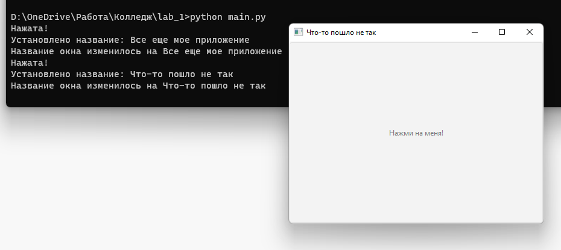

Сначала мы создадим список заголовков окон откуда мы выберем один случайным образом, используя встроенный в Python метод ```random.choice```. Мы подключаем наш пользовательский метод слота ```the_window_title_changed``` к сигналу окна ```windowTitleChanged```.

Когда мы нажимаем кнопку, заголовок окна будет меняться случайным образом. Если заголовок нового окна равен "Что-то пошло не так", кнопка будет отключена.

В этом примере есть несколько вещей, на которые стоит обратить внимание:

- Во-первых, сигнал ```windowTitleChanged``` не всегда выдается при установке заголовка окна. Сигнал срабатывает только в том случае, если новый заголовок отличается от предыдущего. Если вы установите один и тот же заголовок несколько раз, сигнал сработает только в первый раз. Важно перепроверить условия, при которых срабатывают сигналы, чтобы не удивляться их использованию в приложении
- Во-вторых, обратите внимание, как мы можем связать вещи вместе, используя сигналы. Одно событие - нажатие кнопки может вызвать несколько других событий по очереди. Этим последующим эффектам не нужно знать, что их вызвало, они просто следуют как следствие простых правил. Это отделение эффектов от их триггеров является одной из ключевых концепций, которые необходимо понимать при создании приложений с графическим интерфейсом.

### Соединение виджетов напрямую

До сих пор мы видели примеры подключения сигналов виджета к методам Python. Когда сигнал поступает из виджета, вызывается наш метод Python, который получает данные из сигнала. Но вам не всегда нужно использовать функцию Python для обработки сигналов - вы также можете напрямую соединять виджеты Qt друг с другом.

В следующем примере мы добавляем в окно виджет ```QLineEdit``` и ```QLabel```. Мы подключаем наш сигнал редактирования строки ```textChanged``` к методу ```setText``` в ```QLabel```. Теперь каждый раз, когда текст изменяется в ```QLineEdit```, ```QLabel``` будет получать этот текст в свой метод ```setText```.

```python
import PySide2.QtWidgets as psqw
import PySide2.QtCore as psqc

class MainWindow(psqw.QMainWindow):
    def __init__(self):
        super().__init__()

        self.setWindowTitle('Мое приложение')

        self.label = psqw.QLabel()

        self.input = psqw.QLineEdit()
        self.input.textChanged.connect(self.label.setText)

        layout = psqw.QVBoxLayout()
        layout.addWidget(self.input)
        layout.addWidget(self.label)

        container = psqw.QWidget()
        container.setLayout(layout)

        self.setCentralWidget(container)

app = psqw.QApplication()

window = MainWindow()
window.show()

app.exec_()
```

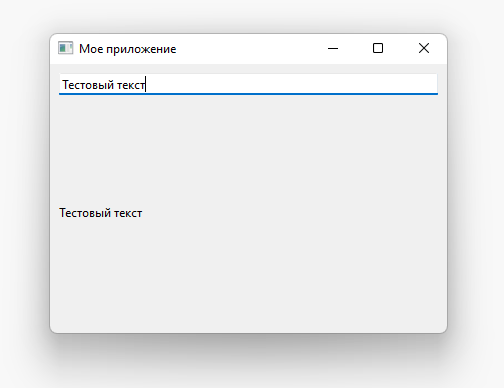

Обратите внимание, что для подключения входа к метке должны быть определены и вход, и метка. Этот код добавляет два виджета в макет и устанавливает их в окне. Мы подробно рассмотрим макеты позже, пока вы можете их игнорировать.

Большинство виджетов Qt имеют доступные слоты, к которым вы можете подключить любой сигнал, испускающий тот же тип, что и принимаемый. В документации виджета есть слоты для каждого виджета.

### События

Каждое взаимодействие пользователя с приложением ```Qt``` является событием. Существует множество типов событий, каждое из которых представляет собой отдельный тип взаимодействия. ```Qt``` представляет эти события с помощью объектов событий, которые упаковывают информацию о том, что произошло. Эти события передаются определенным обработчикам событий в виджете, где произошло взаимодействие.

Определив пользовательские или расширенные обработчики событий, вы можете изменить способ, которым ваши виджеты реагируют на эти события. Обработчики событий определяются так же, как и любые другие методы, но имя зависит от типа обрабатываемого ими события.

Одним из основных событий, которые получают виджеты, является ```QMouseEvent```. События ```QMouseEvent``` создаются для каждого движения мыши и нажатия кнопки на виджете. Для обработки событий мыши доступны следующие обработчики событий:

- ```mouseMoveEvent``` - движение мыши
- ```mousePressEvent``` - кнопка мыши нажата
- ```mouseReleaseEvent``` - кнопка мыши отпущена
- ```mouseDoubleClickEvent``` - двойное нажатие кнопки мыши

Например, щелчок по виджету вызовет отправку ```QMouseEvent``` обработчику событий ```mousePressEvent``` этого виджета. Этот обработчик может использовать объект события, чтобы узнать информацию о том, что произошло, например, что вызвало событие и где именно оно произошло.

Вы можете перехватывать события, создавая подклассы и переопределяя метод обработчика в классе. Вы можете фильтровать, изменять или игнорировать события, передавая их обычному обработчику события, вызывая функцию родительского класса с помощью ```super```. Их можно добавить в класс главного окна следующим образом. В каждом случае ```e``` получит входящее событие.

```python
import PySide2.QtWidgets as psqw
import PySide2.QtCore as psqc

class MainWindow(psqw.QMainWindow):
    def __init__(self):
        super().__init__()

        self.label = psqw.QLabel('Нажми на это окно')
        self.setCentralWidget(self.label)

    def mouseMoveEvent(self, e):
        self.label.setText('mouseMoveEvent')

    def mousePressEvent(self, e):
        self.label.setText('mousePressEvent')

    def mouseReleaseEvent(self, e):
        self.label.setText('mouseReleaseEvent')

    def mouseDoubleClickEvent(self, e):
        self.label.setText('mouseDoubleClickEvent')

app = psqw.QApplication()

window = MainWindow()
window.show()

app.exec_()
```

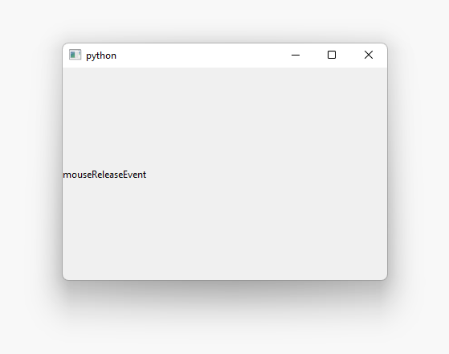

Вы заметите, что события движения мыши регистрируются только тогда, когда вы нажимаете кнопку. Вы можете изменить это, вызвав ```self.setMouseTracking(True)``` в окне. Вы также можете заметить, что события нажатия (щелчка) и двойного щелчка срабатывают при нажатии кнопки. При отпускании кнопки срабатывает только событие освобождения. Как правило, чтобы зарегистрировать щелчок пользователя, вы должны следить как за нажатием мыши, так и за ее отпусканием.

Внутри обработчиков событий у вас есть доступ к объекту события. Этот объект содержит информацию о событии и может использоваться для различных реакций в зависимости от того, что именно произошло.

### События мыши

Все события мыши в ```Qt``` отслеживаются с помощью объекта ```QMouseEvent```, при этом информация о событии может быть прочитана из следующих методов обработки событий.

- ```button``` - конкретная кнопка, вызвавшая это событие
- ```buttons``` - состояние всех кнопок мыши
- ```globalPos``` - глобальная позиция приложения
- ```globalX``` - приложение-глобальная горизонтальная позиция X
- ```globalY``` - приложение-глобальная вертикальная позиция Y
- ```pos``` - относительная позиция виджета как целое число
- ```posF``` - относительная позиция виджета как число с плавающей точкой

Вы можете использовать эти методы в обработчике событий, чтобы по-разному реагировать на разные события или полностью игнорировать их. Позиционные методы предоставляют как глобальную, так и локальную (относительную виджету) информацию о положении в виде объектов ```QPoint```, в то время как кнопки сообщаются с использованием типов кнопок мыши из пространства имен ```Qt```.

Например, следующее позволяет нам по-разному реагировать на левый, правый или средний щелчок по окну.

```python
import PySide2.QtWidgets as psqw
import PySide2.QtCore as psqc

class MainWindow(psqw.QMainWindow):
    def __init__(self):
        super().__init__()

        self.label = psqw.QLabel('Нажми на это окно')
        self.setCentralWidget(self.label)

    def mousePressEvent(self, e):
        if e.button() == psqc.Qt.LeftButton:
            self.label.setText("mousePressEvent LEFT")

        elif e.button() == psqc.Qt.MiddleButton:
            self.label.setText("mousePressEvent MIDDLE")

        elif e.button() == psqc.Qt.RightButton:
            self.label.setText("mousePressEvent RIGHT")

    def mouseReleaseEvent(self, e):
        if e.button() == psqc.Qt.LeftButton:
            self.label.setText("mouseReleaseEvent LEFT")

        elif e.button() == psqc.Qt.MiddleButton:
            self.label.setText("mouseReleaseEvent MIDDLE")

        elif e.button() == psqc.Qt.RightButton:
            self.label.setText("mouseReleaseEvent RIGHT")

    def mouseDoubleClickEvent(self, e):
        if e.button() == psqc.Qt.LeftButton:
            self.label.setText("mouseDoubleClickEvent LEFT")

        elif e.button() == psqc.Qt.MiddleButton:
            self.label.setText("mouseDoubleClickEvent MIDDLE")

        elif e.button() == psqc.Qt.RightButton:
            self.label.setText("mouseDoubleClickEvent RIGHT")

app = psqw.QApplication()

window = MainWindow()
window.show()

app.exec_()
```

### Контекстные меню

Контекстные меню - это небольшие контекстно-зависимые меню, которые обычно появляются при щелчке правой кнопкой мыши по окну. ```Qt``` поддерживает создание этих меню, а виджеты имеют определенное событие, используемое для их запуска. В следующем примере мы собираемся перехватить ```contextMenuEvent```. Это событие запускается всякий раз, когда должно быть показано контекстное меню, и ему передается событие с одним значением типа ```QContextMenuEvent```.

Чтобы перехватить событие, мы просто переопределяем метод объекта нашим новым одноименным методом. Итак, в этом случае мы можем создать метод в нашем подклассе ```MainWindow``` с именем ```contextMenuEvent```, и он будет получать все события этого типа.

```python
import PySide2.QtWidgets as psqw

class MainWindow(psqw.QMainWindow):
    def __init__(self):
        super().__init__()

    def contextMenuEvent(self, e):
        context = psqw.QMenu(self)
        context.addAction(psqw.QAction("test 1", self))
        context.addAction(psqw.QAction("test 2", self))
        context.addAction(psqw.QAction("test 3", self))
        context.exec(e.globalPos())

app = psqw.QApplication()

window = MainWindow()
window.show()

app.exec_()
```

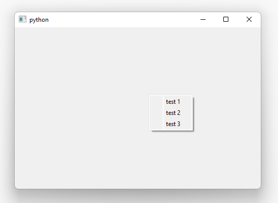
