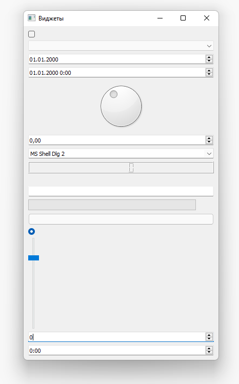
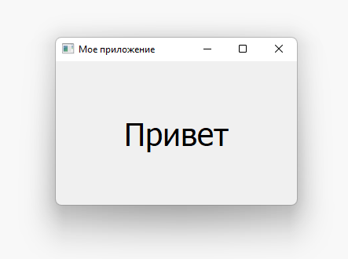
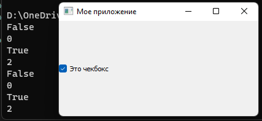
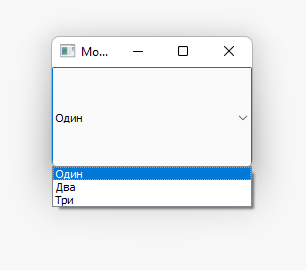
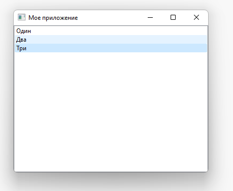
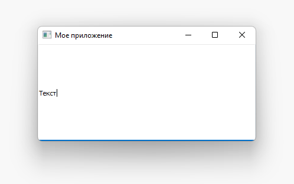
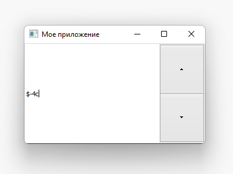
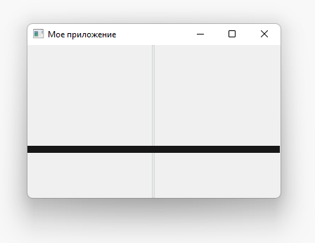
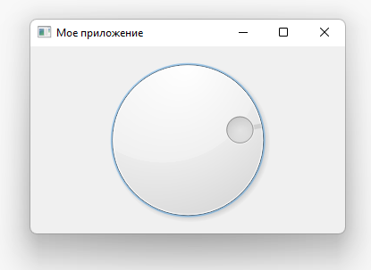

# Лекция №2

## Виджеты

### Демо

Сначала давайте посмотрим на некоторые из наиболее распространенных виджетов Qt. Следующий код создает ряд виджетов Qt и добавляет их в макет окна, чтобы вы могли видеть их вместе.

```python
import sys

import PySide2.QtWidgets as psqw

class MainWindow(psqw.QMainWindow):
    def __init__(self):
        super().__init__()

        self.setWindowTitle("Виджеты")

        layout = psqw.QVBoxLayout()
        widgets = [
            psqw.QCheckBox,
            psqw.QComboBox,
            psqw.QDateEdit,
            psqw.QDateTimeEdit,
            psqw.QDial,
            psqw.QDoubleSpinBox,
            psqw.QFontComboBox,
            psqw.QLCDNumber,
            psqw.QLabel,
            psqw.QLineEdit,
            psqw.QProgressBar,
            psqw.QPushButton,
            psqw.QRadioButton,
            psqw.QSlider,
            psqw.QSpinBox,
            psqw.QTimeEdit,
        ]

        for w in widgets:
            layout.addWidget(w())

        widget = psqw.QWidget()
        widget.setLayout(layout)

        self.setCentralWidget(widget)

app = psqw.QApplication(sys.argv)
window = MainWindow()
window.show()

app.exec_()
```



| QCheckbox      | Чекбокс                                                |
| -------------- | ------------------------------------------------------ |
| QComboBox      | Выпадающий список                                      |
| QDateEdit      | Для редактирования даты                                |
| QDateTimeEdit  | Для редактирования даты и времени                      |
| QDial          | Поворотный циферблат                                   |
| QDoubleSpinbox | Спиннер чисел                                          |
| QFontComboBox  | Список шрифтов                                         |
| QLCDNumber     | ЖК-дисплей                                             |
| QLabel         | Надпись                                                |
| QLineEdit      | Введите строку текста                                  |
| QProgressBar   | Индикатор выполнения                                   |
| QPushButton    | Кнопка                                                 |
| QRadioButton   | Набор переключателей только с одним активным элементом |
| QSlider        | Ползунок                                               |
| QSpinBox       | Целочисленный счетчик                                  |
| QTimeEdit      | Время редактирования                                   |

Виджетов гораздо больше. Вы можете увидеть их все, просмотрев документацию Qt.

Далее мы рассмотрим некоторые из наиболее часто используемых виджетов и рассмотрим их более подробно.

### QLabel

Мы начнем экскурсию с `QLabel`, пожалуй, одного из самых простых виджетов, доступных в наборе инструментов Qt. Это простой однострочный фрагмент текста, который вы можете разместить в своем приложении. Вы можете установить текст, передав строку при его создании:

```python
widget = QLabel("Привет")
```

Или использовать метод `setText`:

```python
widget = QLabel("1")
widget.setText("2")
```

Вы также можете настроить параметры шрифта, такие как размер шрифта или выравнивание текста в виджете:

```python
import sys

import PySide2.QtWidgets as psqw
import PySide2.QtCore as psqc

class MainWindow(psqw.QMainWindow):

    def __init__(self):
        super(MainWindow, self).__init__()

        self.setWindowTitle("Мое приложение")

        widget = psqw.QLabel("Привет")
        font = widget.font()
        font.setPointSize(30)
        widget.setFont(font)
        widget.setAlignment(psqc.Qt.AlignHCenter | psqc.Qt.AlignVCenter)

        self.setCentralWidget(widget)

app = psqw.QApplication(sys.argv)
window = MainWindow()
window.show()

app.exec_()
```



Выравнивание задается с помощью флага из класса Qt. Для горизонтального выравнивания доступны следующие флаги:

| AlignLeft    | Выравнивается по левому краю                         |
| ------------ | ---------------------------------------------------- |
| AlignRight   | Выравнивается по правому краю                        |
| AlignHCenter | Центрируется по горизонтали в доступном пространстве |
| AlignJustify | Выравнивает текст в доступном пространстве           |

Для вертикального выравнивания доступны следующие флаги:

| AlignTop     | Выравнивается с верхом                             |
| ------------ | -------------------------------------------------- |
| AlignBottom  | Выравнивается по низу                              |
| AlignVCenter | Центрируется по вертикали в доступном пространстве |

Вы можете комбинировать флаги вместе с помощью вертикальной черты `|`, однако обратите внимание, что одновременно вы можете использовать только флаг вертикального или горизонтального выравнивания:

```python
align_top_left = Qt.AlignLeft | Qt.AlignTop
```

Наконец, есть также сокращенный флаг, который центрируется в обоих направлениях одновременно:

| AlignCenter | Центрирование по горизонтали и вертикали |
| ----------- | ---------------------------------------- |

### QCheckBox

Следующий виджет, на который следует обратить внимание это `QCheckBox`, который, как следует из названия, предоставляет пользователю флажок. Однако, как и во всех виджетах Qt, существует ряд настраиваемых параметров для изменения поведения виджетов.

```python
import sys

import PySide2.QtWidgets as psqw
import PySide2.QtCore as psqc

class MainWindow(psqw.QMainWindow):

    def __init__(self):
        super(MainWindow, self).__init__()

        self.setWindowTitle("Мое приложение")

        widget = psqw.QCheckBox('Это чекбокс')
        widget.setCheckState(psqc.Qt.Checked)

        widget.stateChanged.connect(self.show_state)

        self.setCentralWidget(widget)

    def show_state(self, s):
        print(s == psqc.Qt.Checked)
        print(s)

app = psqw.QApplication(sys.argv)
window = MainWindow()
window.show()

app.exec_()
```



Вы можете установить состояние флажка программно, используя `setChecked` или `setCheckState`. Первый принимает либо `True`, либо `False`, представляющий отмеченный или не отмеченный соответственно. Однако с помощью `setCheckState` вы также указываете конкретное проверенное состояние с помощью Qt. Флаг пространства имен:

| Unchecked        | Пункт не отмечен       |
| ---------------- | ---------------------- |
| PartiallyChecked | Пункт частично отмечен |
| Checked          | Пункт отмечен          |

Флажок, который поддерживает частично проверенное состояние (`PartiallyChecked`), обычно называется «трехуровневым состоянием», то есть ни включенным, ни выключенным. Флажок в этом состоянии обычно отображается как серый флажок и обычно используется в иерархических схемах флажков, где подэлементы связаны с родительскими флажками.

Если вы установите значение `PartiallyChecked`, флажок будет иметь три состояния. Вы также можете `setTriState(True)`, чтобы установить поддержку трех состояний. Вы также можете установить флажок в три состояния, не устанавливая текущее состояние как частично проверенное с помощью `setTriState(True)`.

### QComboBox

`QComboBox` - это выпадающий список, закрытый по умолчанию стрелкой, чтобы открыть его. Вы можете выбрать один элемент из списка, при этом текущий выбранный элемент отображается в виде метки на виджете. Поле со списком подходит для выбора варианта из длинного списка вариантов.

Вы можете добавлять элементы в `QComboBox`, передавая список строк в `addItems`. Элементы будут добавляться в порядке их предоставления.

```python
import sys

import PySide2.QtWidgets as psqw
import PySide2.QtCore as psqc

class MainWindow(psqw.QMainWindow):

    def __init__(self):
        super(MainWindow, self).__init__()

        self.setWindowTitle("Мое приложение")

        widget = psqw.QComboBox()
        widget.addItems(["Один", "Два", "Три"])

        widget.currentIndexChanged.connect(self.index_changed)

        widget.currentTextChanged.connect(self.text_changed)

        self.setCentralWidget(widget)

    def index_changed(self, i):
        print(i)

    def text_changed(self, s):
        print(s)

app = psqw.QApplication(sys.argv)
window = MainWindow()
window.show()

app.exec_()
```



Сигнал `currentIndexChanged` срабатывает, когда текущий выбранный элемент обновляется, по умолчанию передавая индекс выбранного элемента в списке. Существует также сигнал `currentTextChanged`, который вместо этого предоставляет метку текущего выбранного элемента, что часто более полезно.

`QComboBox` также можно редактировать, позволяя пользователям вводить значения, которых в данный момент нет в списке, и либо вставлять их, либо просто использовать в качестве значения. Чтобы сделать поле редактируемым:

```python
widget.setEditable(True)
```

Вы также можете установить флаг, чтобы определить, как обрабатывается вставка. Эти флаги хранятся в самом классе `QComboBox` и перечислены ниже:

| NoInsert             | Нет вставки                        |
| -------------------- | ---------------------------------- |
| InsertAtTop          | Вставить как первый элемент        |
| InsertAtCurrent      | Заменить текущий выбранный элемент |
| InsertAtBottom       | Вставить после последнего элемента |
| InsertAfterCurrent   | Вставить после текущего элемента   |
| InsertBeforeCurrent  | Вставить перед текущим элементом   |
| InsertAlphabetically | Вставить в алфавитном порядке      |

Чтобы использовать их, примените флаг следующим образом:

```python
widget.setInsertPolicy(QComboBox.InsertAlphabetically)
```

Вы также можете ограничить количество элементов, разрешенных в поле, с помощью `setMaxCount`, например:

```python
widget.setMaxCount(10)
```

### QListWidget

Следующий `QListWidget`. Он очень похож на `QComboBox`, но отличается в основном доступными сигналами.

```python
import sys

import PySide2.QtWidgets as psqw
import PySide2.QtCore as psqc

class MainWindow(psqw.QMainWindow):

    def __init__(self):
        super(MainWindow, self).__init__()

        self.setWindowTitle("Мое приложение")

        widget = psqw.QListWidget()
        widget.addItems(["Один", "Два", "Три"])

        widget.currentItemChanged.connect(self.index_changed)

        widget.currentTextChanged.connect(self.text_changed)

        self.setCentralWidget(widget)

    def index_changed(self, i):
        print(i)

    def text_changed(self, s):
        print(s)

app = psqw.QApplication(sys.argv)
window = MainWindow()
window.show()

app.exec_()
```



`QListWidget` предлагает сигнал `currentItemChanged`, который отправляет QListItem (элемент списка), и сигнал `currentTextChanged`, который отправляет текст.

### QLineEdit

Виджет `QLineEdit` представляет собой простое однострочное поле редактирования текста, в которое пользователи могут вводить данные. Они используются для полей формы или настроек, где нет ограниченного списка допустимых входных данных. Например, при вводе адреса электронной почты или имени компьютера.

```python
import sys

import PySide2.QtWidgets as psqw
import PySide2.QtCore as psqc

class MainWindow(psqw.QMainWindow):

    def __init__(self):
        super(MainWindow, self).__init__()

        self.setWindowTitle("Мое приложение")

        widget = psqw.QLineEdit()
        widget.setMaxLength(10)
        widget.setPlaceholderText("Введите текст")

        widget.returnPressed.connect(self.return_pressed)
        widget.selectionChanged.connect(self.selection_changed)

        self.setCentralWidget(widget)

    def return_pressed(self):
        self.centralWidget().setText("BOOM!")

    def selection_changed(self):
        print(self.centralWidget().selectedText())

app = psqw.QApplication(sys.argv)
window = MainWindow()
window.show()

app.exec_()
```



Как показано в приведенном выше коде, вы можете установить максимальную длину текста в строке редактирования.

`QLineEdit` имеет ряд сигналов, доступных для различных событий редактирования, в том числе при нажатии возврата (пользователем), при изменении пользовательского выбора. Есть также два сигнала редактирования, один для того, когда текст в поле был отредактирован, а другой для того, когда он был изменен. Здесь проводится различие между пользовательскими правками и программными изменениями. Сигнал `textEdited` отправляется только тогда, когда пользователь редактирует текст.

Кроме того, можно выполнить проверку ввода с помощью маски ввода, чтобы определить, какие символы и где поддерживаются. Это можно применить к полю следующим образом:

```python
widget.setInputMask('000.000.000.000;_')
```

Вышеприведенное позволяет использовать серию трехзначных чисел, разделенных точками, и поэтому может использоваться для проверки адресов IPv4.

Для того, чтобы получить текст из виджета, можно воспользоваться методом `text`:

```python
text = widget.text()
```

### QSpinBox и QDoubleSpinBox

`QSpinBox` предоставляет собой небольшое числовое поле ввода со стрелками для увеличения и уменьшения значения. `QSpinBox` поддерживает целые числа, а связанный виджет `QDoubleSpinBox` поддерживает числа с плавающей запятой.

```python
import sys

import PySide2.QtWidgets as psqw
import PySide2.QtCore as psqc

class MainWindow(psqw.QMainWindow):

    def __init__(self):
        super(MainWindow, self).__init__()

        self.setWindowTitle("Мое приложение")

        widget = psqw.QSpinBox()

        widget.setMinimum(-10)
        widget.setMaximum(3)

        widget.setPrefix("$")
        widget.setSuffix("c")
        widget.setSingleStep(3)

        self.setCentralWidget(widget)

app = psqw.QApplication(sys.argv)
window = MainWindow()
window.show()

app.exec_()
```



В приведенном выше демонстрационном коде показаны различные функции, доступные для виджета.

Чтобы установить диапазон допустимых значений, вы можете использовать `setMinimum` и `setMaximum` или, альтернативно, использовать `setRange` для одновременной установки обоих. Аннотации типов значений поддерживаются как префиксами, так и суффиксами, которые можно добавлять к числу, например. для маркеров валюты или единиц с использованием `setPrefix` и `setSuffix` соответственно.

Щелчок по стрелкам вверх и вниз на виджете увеличивает или уменьшает значение в виджете на величину, которую можно установить с помощью `setSingleStep`. Обратите внимание, что это не влияет на значения, приемлемые для виджета.

И `QSpinBox`, и `QDoubleSpinBox` имеют сигнал `valueChanged`, который срабатывает всякий раз, когда изменяется их значение. Необработанный сигнал `valueChanged` отправляет числовое значение (целое или число с плавающей запятой), а `textChanged` отправляет значение в виде строки, включая символы префикса и суффикса.

### QSlider

`QSlider` предоставляет виджет слайдера, который внутренне функционирует так же, как `QDoubleSpinBox`. Вместо того, чтобы отображать текущее значение в числовом виде, оно представлено положением ручки ползунка по длине виджета. Это часто бывает полезно при настройке между двумя крайними значениями, но когда не требуется абсолютная точность. Чаще всего виджеты этого типа используются для управления громкостью.

Существует дополнительный сигнал `sliderMoved`, который срабатывает всякий раз, когда ползунок перемещает позицию, и сигнал `sliderPressed`, который излучается при каждом щелчке ползунка.

```python
import sys

import PySide2.QtWidgets as psqw
import PySide2.QtCore as psqc

class MainWindow(psqw.QMainWindow):

    def __init__(self):
        super(MainWindow, self).__init__()

        self.setWindowTitle("Мое приложение")

        widget = psqw.QSlider()

        widget.setMinimum(-10)
        widget.setMaximum(3)

        widget.setSingleStep(3)

        widget.valueChanged.connect(self.value_changed)
        widget.sliderMoved.connect(self.slider_position)
        widget.sliderPressed.connect(self.slider_pressed)
        widget.sliderReleased.connect(self.slider_released)

        self.setCentralWidget(widget)

    def value_changed(self, i):
        print(i)

    def slider_position(self, p):
        print("position", p)

    def slider_pressed(self):
        print("Pressed!")

    def slider_released(self):
        print("Released")

app = psqw.QApplication(sys.argv)
window = MainWindow()
window.show()

app.exec_()
```



Вы также можете создать ползунок с вертикальной или горизонтальной ориентацией, передав ориентацию при ее создании. Флаги ориентации определены в Qt.

```python
widget.QSlider(Qt.Vertical)
# or
widget.QSlider(Qt.Horizontal)
```

### QDial

Наконец, `QDial` - это вращающийся виджет, который работает так же, как ползунок, но выглядит как аналоговый циферблат. Это выглядит красиво, но с точки зрения пользовательского интерфейса не особенно удобно для пользователя. Однако они часто используются в аудиоприложениях как представление реальных аналоговых циферблатов.

```python
import sys

import PySide2.QtWidgets as psqw
import PySide2.QtCore as psqc

class MainWindow(psqw.QMainWindow):

    def __init__(self):
        super(MainWindow, self).__init__()

        self.setWindowTitle("Мое приложение")

        widget = psqw.QDial()
        widget.setRange(-10, 100)
        widget.setSingleStep(0.5)

        widget.valueChanged.connect(self.value_changed)
        widget.sliderMoved.connect(self.slider_position)
        widget.sliderPressed.connect(self.slider_pressed)
        widget.sliderReleased.connect(self.slider_released)

        self.setCentralWidget(widget)

    def value_changed(self, i):
        print(i)

    def slider_position(self, p):
        print("position", p)

    def slider_pressed(self):
        print("Pressed!")

    def slider_released(self):
        print("Released")

app = psqw.QApplication(sys.argv)
window = MainWindow()
window.show()

app.exec_()
```


