# Лекция №3

## Макеты

### Общее

На данный момент мы успешно создали окно и добавили в него виджет. Однако обычно мы хотим добавить в окно более одного виджета и иметь некоторый контроль над тем, где он заканчивается. Для этого в Qt мы используем макеты. В Qt доступно 4 основных макета, которые перечислены в следующей таблице:

|                |                                    |
| -------------- | ---------------------------------- |
| QHBoxLayout    | Линейная горизонтальная планировка |
| QVBoxLayout    | Линейная вертикальная планировка   |
| QGridLayout    | В индексируемой сетке              |
| QStackedLayout | Сложены друг перед другом          |

Как видите, в Qt доступно три позиционных макета: `QVBoxLayout`, `QHBoxLayout` и `QGridLayout`. Кроме того, есть также `QStackedLayout`, который позволяет вам размещать виджеты один поверх другого в одном и том же пространстве, но отображая только один макет за раз.

Прежде чем мы начнем, нам нужна простая схема приложения. Сохраните следующий код в файле - мы изменим это приложение, чтобы поэкспериментировать с различными макетами:

```python
import sys

import PySide2.QtWidgets as psqw
import PySide2.QtCore as psqc

class MainWindow(psqw.QMainWindow):

    def __init__(self):
        super(MainWindow, self).__init__()

        self.setWindowTitle("Мое приложение")

app = psqw.QApplication(sys.argv)

window = MainWindow()
window.show()

app.exec_()
```

Чтобы упростить визуализацию макетов, мы сначала создадим простой пользовательский виджет, который отображает сплошной цвет по нашему выбору. Это поможет различать виджеты, которые мы добавляем в макет. Добавьте следующий код в свой файл в качестве нового класса на верхнем уровне:

```python
class Color(psqw.QWidget):

    def __init__(self, color):
        super(Color, self).__init__()
        self.setAutoFillBackground(True)

        palette = self.palette()
        palette.setColor(psqg.QPalette.Window, psqg.QColor(color))
        self.setPalette(palette)
```

В этом коде мы создаем подкласс `QWidget` для создания собственного пользовательского виджета `Color`. Мы принимаем единственный параметр при создании виджета цвет. Сначала мы устанавливаем для `setAutoFillBackground` значение `True`, чтобы сообщить виджету, что его фон автоматически заполняется. Затем мы получаем текущую палитру (которая по умолчанию является глобальной палитрой рабочего стола) и меняем текущий цвет `QPalette.Window` на новый `QColor`, описываемый переданным значением цвета. Наконец, мы применяем эту палитру обратно к виджету. Конечным результатом является виджет, заполненный сплошным цветом, который мы указали при его создании.

Если вы находите вышеизложенное запутанным, не беспокойтесь слишком сильно. Позже мы рассмотрим пользовательские виджеты более подробно. На данный момент достаточно, чтобы вы поняли, что при вызове вы можете создать красный виджет со сплошной заливкой, выполнив следующие действия:

```python
Color('red')
```

Сначала давайте протестируем наш новый виджет «Цвет», используя его для заливки всего окна одним цветом. Как только это будет завершено, мы можем добавить его в `QMainWindow` с помощью `setCentralWidget`, и мы получим сплошное красное окно:

```python
import sys

import PySide2.QtWidgets as psqw
import PySide2.QtCore as psqc
import PySide2.QtGui as psqg

class Color(psqw.QWidget):

    def __init__(self, color):
        super(Color, self).__init__()
        self.setAutoFillBackground(True)

        palette = self.palette()
        palette.setColor(psqg.QPalette.Window, psqg.QColor(color))
        self.setPalette(palette)

class MainWindow(psqw.QMainWindow):

    def __init__(self):
        super(MainWindow, self).__init__()

        self.setWindowTitle("Мое приложение")

        widget = Color('red')

        self.setCentralWidget(widget)

app = psqw.QApplication(sys.argv)

window = MainWindow()
window.show()

app.exec_()
```

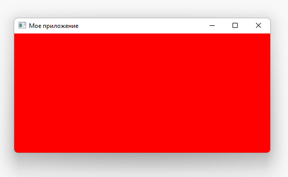

Далее мы по очереди рассмотрим каждый из доступных макетов Qt. Обратите внимание, что для добавления наших макетов в окно нам понадобится фиктивный QWidget для хранения макета.

### QVBoxLayout

С `QVBoxLayout` вы размещаете виджеты один над другим линейно. Добавление виджета добавляет его в конец столбца.

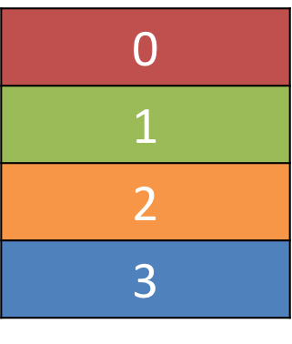

Давайте добавим наш виджет в макет. Обратите внимание, что для добавления макета в `QMainWindow` нам нужно применить его к фиктивному `QWidget`. Это позволяет нам затем использовать `setCentralWidget` для применения виджета (и макета) к окну. Наши цветные виджеты будут располагаться в макете, содержащемся в `QWidget` в окне. Сначала мы просто добавляем красный виджет, как и раньше:

```python
import sys

import PySide2.QtWidgets as psqw
import PySide2.QtCore as psqc
import PySide2.QtGui as psqg

class Color(psqw.QWidget):

    def __init__(self, color):
        super(Color, self).__init__()
        self.setAutoFillBackground(True)

        palette = self.palette()
        palette.setColor(psqg.QPalette.Window, psqg.QColor(color))
        self.setPalette(palette)

class MainWindow(psqw.QMainWindow):

    def __init__(self):
        super(MainWindow, self).__init__()

        self.setWindowTitle("Мое приложение")

        layout = psqw.QVBoxLayout()
        layout.addWidget(Color('red'))

        widget = psqw.QWidget()
        widget.setLayout(layout)

        self.setCentralWidget(widget)

app = psqw.QApplication(sys.argv)

window = MainWindow()
window.show()

app.exec_()
```

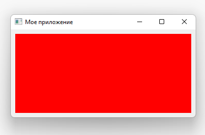

Если вы добавите в макет еще несколько цветных виджетов, вы заметите, что они выстраиваются вертикально в том порядке, в котором они были добавлены:

```python
import sys

import PySide2.QtWidgets as psqw
import PySide2.QtCore as psqc
import PySide2.QtGui as psqg

class Color(psqw.QWidget):

    def __init__(self, color):
        super(Color, self).__init__()
        self.setAutoFillBackground(True)

        palette = self.palette()
        palette.setColor(psqg.QPalette.Window, psqg.QColor(color))
        self.setPalette(palette)

class MainWindow(psqw.QMainWindow):

    def __init__(self):
        super(MainWindow, self).__init__()

        self.setWindowTitle("Мое приложение")

        layout = psqw.QVBoxLayout()
        layout.addWidget(Color('red'))
        layout.addWidget(Color('green'))
        layout.addWidget(Color('blue'))

        widget = psqw.QWidget()
        widget.setLayout(layout)

        self.setCentralWidget(widget)

app = psqw.QApplication(sys.argv)

window = MainWindow()
window.show()

app.exec_()
```

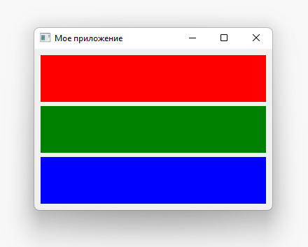

### QHBoxLayout

`QHBoxLayout` - то же самое, за исключением перемещения по горизонтали. Добавление виджета добавляет его в правую сторону.


Чтобы использовать его, мы можем просто изменить `QVBoxLayout` на `QHBoxLayout`. Ящики теперь текут слева направо:

```python
import sys

import PySide2.QtWidgets as psqw
import PySide2.QtCore as psqc
import PySide2.QtGui as psqg

class Color(psqw.QWidget):

    def __init__(self, color):
        super(Color, self).__init__()
        self.setAutoFillBackground(True)

        palette = self.palette()
        palette.setColor(psqg.QPalette.Window, psqg.QColor(color))
        self.setPalette(palette)

class MainWindow(psqw.QMainWindow):

    def __init__(self):
        super(MainWindow, self).__init__()

        self.setWindowTitle("Мое приложение")

        layout = psqw.QHBoxLayout()
        layout.addWidget(Color('red'))
        layout.addWidget(Color('green'))
        layout.addWidget(Color('blue'))

        widget = psqw.QWidget()
        widget.setLayout(layout)

        self.setCentralWidget(widget)

app = psqw.QApplication(sys.argv)

window = MainWindow()
window.show()

app.exec_()
```

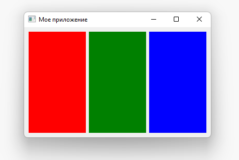

### Вложенные макеты

Для более сложных макетов вы можете вкладывать макеты друг в друга, используя `addLayout` в макете. Ниже мы добавляем `QVBoxLayout` в основной `QHBoxLayout`. Если мы добавим некоторые виджеты в `QVBoxLayout`, они будут располагаться вертикально в первом слоте родительского макета:

```python
import sys

import PySide2.QtWidgets as psqw
import PySide2.QtCore as psqc
import PySide2.QtGui as psqg

class Color(psqw.QWidget):

    def __init__(self, color):
        super(Color, self).__init__()
        self.setAutoFillBackground(True)

        palette = self.palette()
        palette.setColor(psqg.QPalette.Window, psqg.QColor(color))
        self.setPalette(palette)

class MainWindow(psqw.QMainWindow):

    def __init__(self):
        super(MainWindow, self).__init__()

        self.setWindowTitle("Мое приложение")

        layout1 = psqw.QHBoxLayout()
        layout2 = psqw.QVBoxLayout()
        layout3 = psqw.QVBoxLayout()

        layout2.addWidget(Color('red'))
        layout2.addWidget(Color('yellow'))
        layout2.addWidget(Color('purple'))

        layout1.addLayout( layout2 )

        layout1.addWidget(Color('green'))

        layout3.addWidget(Color('red'))
        layout3.addWidget(Color('purple'))

        layout1.addLayout( layout3 )

        widget = psqw.QWidget()
        widget.setLayout(layout1)
        self.setCentralWidget(widget)

app = psqw.QApplication(sys.argv)

window = MainWindow()
window.show()

app.exec_()
```

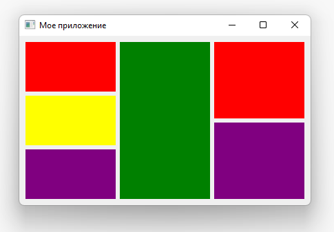

Вы можете установить интервал вокруг макета с помощью `setContentMargins` или установить интервал между элементами с помощью `setSpacing`:

```python
layout1.setContentsMargins(0,0,0,0)
layout1.setSpacing(20)
```

В следующем коде показано сочетание вложенных виджетов, полей макета и интервалов. Поэкспериментируйте с числами, пока не почувствуете их:

```python
import sys

import PySide2.QtWidgets as psqw
import PySide2.QtCore as psqc
import PySide2.QtGui as psqg

class Color(psqw.QWidget):

    def __init__(self, color):
        super(Color, self).__init__()
        self.setAutoFillBackground(True)

        palette = self.palette()
        palette.setColor(psqg.QPalette.Window, psqg.QColor(color))
        self.setPalette(palette)

class MainWindow(psqw.QMainWindow):

    def __init__(self):
        super(MainWindow, self).__init__()

        self.setWindowTitle("Мое приложение")

        layout1 = psqw.QHBoxLayout()
        layout2 = psqw.QVBoxLayout()
        layout3 = psqw.QVBoxLayout()

        layout1.setContentsMargins(0,0,0,0)
        layout1.setSpacing(20)

        layout2.addWidget(Color('red'))
        layout2.addWidget(Color('yellow'))
        layout2.addWidget(Color('purple'))

        layout1.addLayout(layout2)

        layout1.addWidget(Color('green'))

        layout3.addWidget(Color('red'))
        layout3.addWidget(Color('purple'))

        layout1.addLayout(layout3)

        widget = psqw.QWidget()
        widget.setLayout(layout1)
        self.setCentralWidget(widget)

app = psqw.QApplication(sys.argv)

window = MainWindow()
window.show()

app.exec_()
```

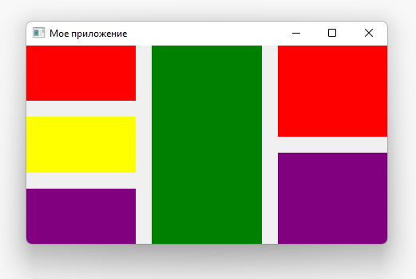

### QGridLayout

Какими бы полезными они ни были, если вы попытаетесь использовать `QVBoxLayout` и `QHBoxLayout` для размещения нескольких элементов, например для формы вам будет очень сложно обеспечить соответствие виджетов разного размера. Решением этого является `QGridLayout`.

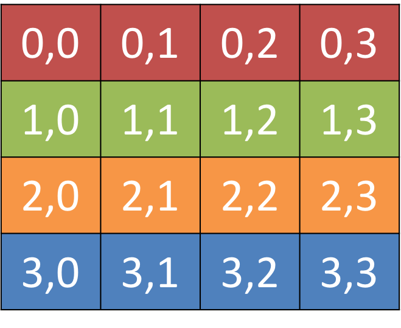

`QGridLayout` позволяет размещать элементы именно в сетке. Вы указываете позиции строк и столбцов для каждого виджета. Вы можете пропустить элементы, и они останутся пустыми.

Полезно то, что для `QGridLayout` вам не нужно заполнять все позиции в сетке.

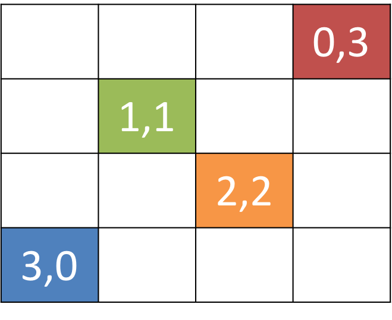

```python
import sys

import PySide2.QtWidgets as psqw
import PySide2.QtCore as psqc
import PySide2.QtGui as psqg

class Color(psqw.QWidget):

    def __init__(self, color):
        super(Color, self).__init__()
        self.setAutoFillBackground(True)

        palette = self.palette()
        palette.setColor(psqg.QPalette.Window, psqg.QColor(color))
        self.setPalette(palette)

class MainWindow(psqw.QMainWindow):

    def __init__(self):
        super(MainWindow, self).__init__()

        self.setWindowTitle("Мое приложение")

        layout = psqw.QGridLayout()

        layout.addWidget(Color('red'), 0, 0)
        layout.addWidget(Color('green'), 1, 0)
        layout.addWidget(Color('blue'), 1, 1)
        layout.addWidget(Color('purple'), 2, 1)

        widget = psqw.QWidget()
        widget.setLayout(layout)
        self.setCentralWidget(widget)

app = psqw.QApplication(sys.argv)

window = MainWindow()
window.show()

app.exec_()
```

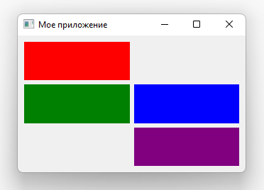

### QStackedLayout

Последний макет, который мы рассмотрим - это `QStackedLayout`. Как описано, этот макет позволяет размещать элементы непосредственно друг перед другом. Затем вы можете выбрать, какой виджет вы хотите показать. Вы можете использовать это для рисования слоев в графическом приложении или для имитации интерфейса, похожего на вкладку. Обратите внимание, что существует также `QStackedWidget`, виджет-контейнер, который работает точно так же. Это полезно, если вы хотите добавить стек непосредственно в `QMainWindow` с помощью `setCentralWidget`.

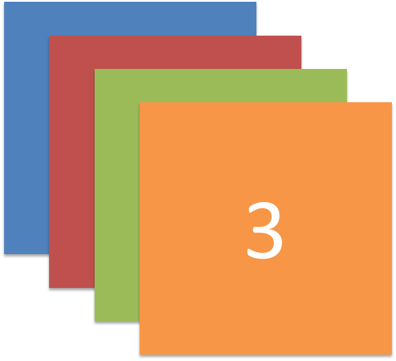

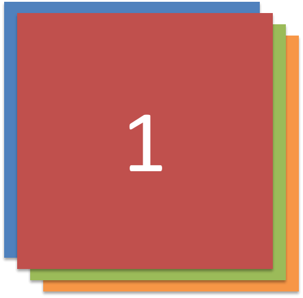

```python
import sys

import PySide2.QtWidgets as psqw
import PySide2.QtCore as psqc
import PySide2.QtGui as psqg

class Color(psqw.QWidget):

    def __init__(self, color):
        super(Color, self).__init__()
        self.setAutoFillBackground(True)

        palette = self.palette()
        palette.setColor(psqg.QPalette.Window, psqg.QColor(color))
        self.setPalette(palette)

class MainWindow(psqw.QMainWindow):

    def __init__(self):
        super(MainWindow, self).__init__()

        self.setWindowTitle("Мое приложение")

        layout = psqw.QStackedLayout()

        layout.addWidget(Color("red"))
        layout.addWidget(Color("green"))
        layout.addWidget(Color("blue"))
        layout.addWidget(Color("yellow"))

        layout.setCurrentIndex(3)

        widget = psqw.QWidget()
        widget.setLayout(layout)
        self.setCentralWidget(widget)

app = psqw.QApplication(sys.argv)

window = MainWindow()
window.show()

app.exec_()
```

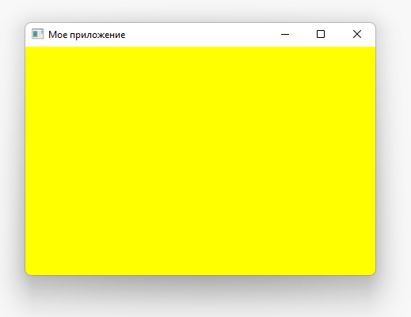

`QStackedWidget` - это именно то, как работают представления с вкладками в приложениях. В каждый момент времени отображается только одно представление («вкладка»). Вы можете контролировать, какой виджет отображать в любое время, используя `setCurrentIndex` или `setCurrentWidget`, чтобы установить элемент либо по индексу (в порядке добавления виджетов), либо по самому виджету.

Ниже приведена короткая демонстрация использования `QStackedLayout` в сочетании с `QButton` для предоставления приложению интерфейса, похожего на вкладку:

```python
import sys

import PySide2.QtWidgets as psqw
import PySide2.QtCore as psqc
import PySide2.QtGui as psqg

class Color(psqw.QWidget):

    def __init__(self, color):
        super(Color, self).__init__()
        self.setAutoFillBackground(True)

        palette = self.palette()
        palette.setColor(psqg.QPalette.Window, psqg.QColor(color))
        self.setPalette(palette)

class MainWindow(psqw.QMainWindow):

    def __init__(self):
        super(MainWindow, self).__init__()

        self.setWindowTitle("Мое приложение")

        pagelayout = psqw.QVBoxLayout()
        button_layout = psqw.QHBoxLayout()
        self.stacklayout = psqw.QStackedLayout()

        pagelayout.addLayout(button_layout)
        pagelayout.addLayout(self.stacklayout)

        btn = psqw.QPushButton("red")
        btn.pressed.connect(self.activate_tab_1)
        button_layout.addWidget(btn)
        self.stacklayout.addWidget(Color("red"))

        btn = psqw.QPushButton("green")
        btn.pressed.connect(self.activate_tab_2)
        button_layout.addWidget(btn)
        self.stacklayout.addWidget(Color("green"))

        btn = psqw.QPushButton("yellow")
        btn.pressed.connect(self.activate_tab_3)
        button_layout.addWidget(btn)
        self.stacklayout.addWidget(Color("yellow"))

        widget = psqw.QWidget()
        widget.setLayout(pagelayout)
        self.setCentralWidget(widget)

    def activate_tab_1(self):
        self.stacklayout.setCurrentIndex(0)

    def activate_tab_2(self):
        self.stacklayout.setCurrentIndex(1)

    def activate_tab_3(self):
        self.stacklayout.setCurrentIndex(2)

app = psqw.QApplication(sys.argv)

window = MainWindow()
window.show()

app.exec_()
```

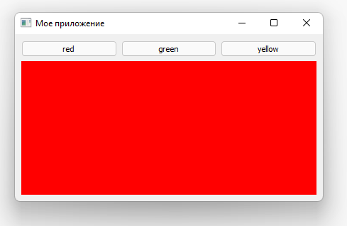

Qt на самом деле предоставляет встроенный `TabWidget`, который предоставляет такой макет из коробки, хотя и в форме виджета. Ниже демонстрация вкладки воссоздана с использованием QTabWidget:

```python
import sys

import PySide2.QtWidgets as psqw
import PySide2.QtCore as psqc
import PySide2.QtGui as psqg

class Color(psqw.QWidget):

    def __init__(self, color):
        super(Color, self).__init__()
        self.setAutoFillBackground(True)

        palette = self.palette()
        palette.setColor(psqg.QPalette.Window, psqg.QColor(color))
        self.setPalette(palette)

class MainWindow(psqw.QMainWindow):

    def __init__(self):
        super(MainWindow, self).__init__()

        self.setWindowTitle("Мое приложение")

        tabs = psqw.QTabWidget()
        tabs.setTabPosition(psqw.QTabWidget.West)
        tabs.setMovable(True)

        for n, color in enumerate(["red", "green", "blue", "yellow"]):
            tabs.addTab(Color(color), color)

        self.setCentralWidget(tabs)

app = psqw.QApplication(sys.argv)

window = MainWindow()
window.show()

app.exec_()
```

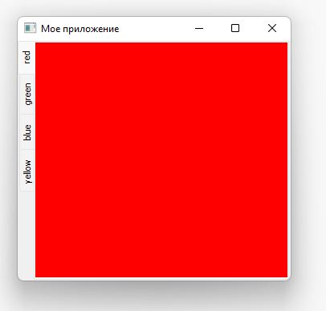

Как видите, это немного проще и немного привлекательнее! Вы можете установить положение вкладок, используя основные направления, включить или отключить перемещение вкладок с помощью setMoveable.
