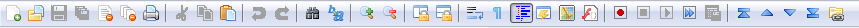
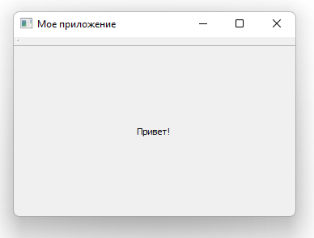
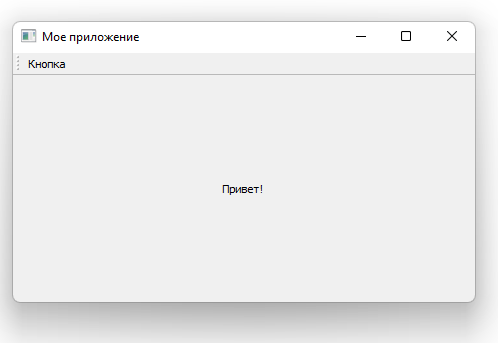
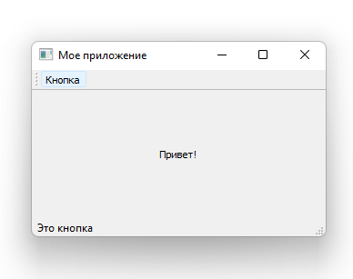
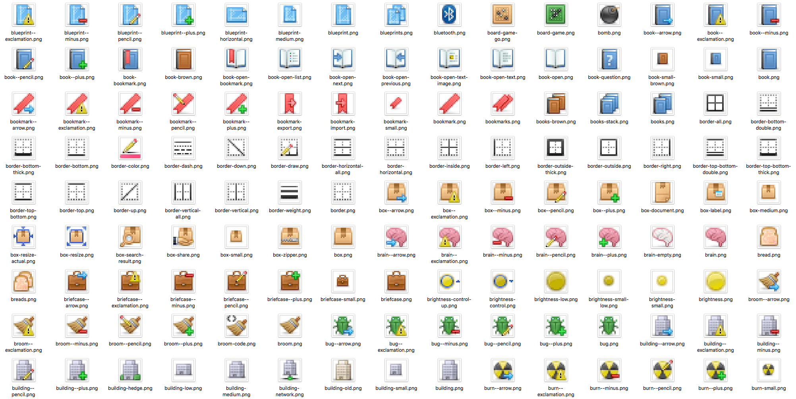
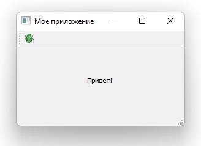
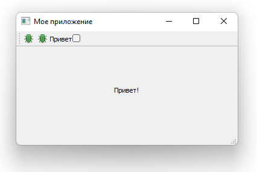
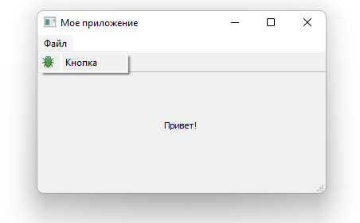
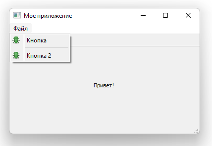
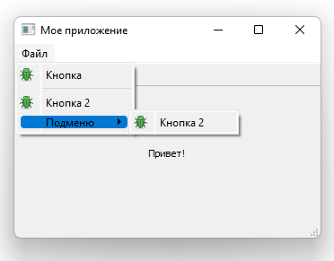

# Лекция №4

## Панели инструментов и меню

### Панели инструментов

Одним из наиболее часто встречающихся элементов пользовательского интерфейса является панель инструментов. Панели инструментов - это панели значков и/или текста, используемые для выполнения общих задач в приложении, для которых доступ через меню был бы громоздким. Они являются одной из наиболее распространенных функций пользовательского интерфейса, встречающихся во многих приложениях. Хотя некоторые сложные приложения, особенно в пакете Microsoft Office, перешли на контекстные «ленточные» интерфейсы, стандартной панели инструментов обычно достаточно для большинства создаваемых вами приложений.



### Добавление панели инструментов

Начнем с добавления панели инструментов в наше приложение.

В Qt панели инструментов создаются из класса `QToolBar`. Для начала вы создаете экземпляр класса, а затем вызываете `addToolbar` в `QMainWindow`. Передача строки в качестве первого параметра в `QToolBar` устанавливает имя панели инструментов, которое будет использоваться для идентификации панели инструментов в пользовательском интерфейсе.

```python
import sys

import PySide2.QtWidgets as psqw
import PySide2.QtCore as psqc

class MainWindow(psqw.QMainWindow):

    def __init__(self):
        super(MainWindow, self).__init__()

        self.setWindowTitle("Мое приложение")

        label = psqw.QLabel("Привет!")
        label.setAlignment(psqc.Qt.AlignCenter)

        self.setCentralWidget(label)

        toolbar = psqw.QToolBar("Моя панель инструментов")
        self.addToolBar(toolbar)

    def onMyToolBarButtonClick(self, s):
        print("Клик", s)

app = psqw.QApplication(sys.argv)

window = MainWindow()
window.show()

app.exec_()
```



Мы должны сделать панель инструментов немного более интересной. Мы могли бы просто добавить виджет `QButton`, но в Qt есть лучший подход, который дает вам некоторые дополнительные функции - через `QAction`. `QAction` - это класс, предоставляющий способ описания абстрактных пользовательских интерфейсов. Это означает, что вы можете определить несколько элементов интерфейса в одном объекте, объединенных эффектом взаимодействия с этим элементом. Например, обычно есть функции, которые представлены на панели инструментов, а также в меню - подумайте о чем-то вроде «Правка-> Вырезать», который присутствует как в меню «Правка», так и на панели инструментов в виде ножниц, а также через сочетание клавиш Ctrl-X.

Без `QAction` вам пришлось бы определять это в нескольких местах. Но с помощью `QAction` вы можете определить одно `QAction`, определяя запускаемое действие, а затем добавить это действие как в меню, так и на панель инструментов. У каждого `QAction` есть имена, сообщения о состоянии, значки и сигналы, к которым вы можете подключиться (и многое другое).

В приведенном ниже коде вы можете увидеть это первое добавленное действие `QAction`.

```python
import sys

import PySide2.QtWidgets as psqw
import PySide2.QtCore as psqc

class MainWindow(psqw.QMainWindow):

    def __init__(self):
        super(MainWindow, self).__init__()

        self.setWindowTitle("Мое приложение")

        label = psqw.QLabel("Привет!")
        label.setAlignment(psqc.Qt.AlignCenter)

        self.setCentralWidget(label)

        toolbar = psqw.QToolBar("Моя панель инструментов")
        self.addToolBar(toolbar)

        button_action = psqw.QAction("Кнопка", self)
        button_action.setStatusTip("Это кнопка")
        button_action.triggered.connect(self.onMyToolBarButtonClick)
        toolbar.addAction(button_action)

    def onMyToolBarButtonClick(self, s):
        print("Клик", s)

app = psqw.QApplication(sys.argv)

window = MainWindow()
window.show()

app.exec_()
```



Для начала мы создадим функцию, которая будет принимать сигнал от `QAction`, чтобы мы могли видеть, работает ли она. Далее мы определяем сам `QAction`. При создании экземпляра мы можем передать метку для действия и/или значок. Вы также должны передать любой объект `QObject`, который будет выступать в качестве родителя для действия - здесь мы передаем себя как ссылку на наше главное окно. Как ни странно, для `QAction` родительский элемент передается в качестве последнего параметра.

Затем мы можем установить подсказку состояния - этот текст будет отображаться в строке состояния, как только она у нас появится. Наконец, мы подключаем сигнал `triggered` к пользовательской функции. Этот сигнал будет срабатывать всякий раз, когда запускается (или активируется) `QAction`.

Далее мы можем добавить строку состояния.

Мы создаем объект строки состояния, вызывая `QStatusBar`, чтобы получить новый объект строки состояния, а затем передаем его в `setStatusBar`. Поскольку нам не нужно изменять настройки строки состояния, мы также можем просто передать ее при создании в одной строке:

```python
import sys

import PySide2.QtWidgets as psqw
import PySide2.QtCore as psqc

class MainWindow(psqw.QMainWindow):

    def __init__(self):
        super(MainWindow, self).__init__()

        self.setWindowTitle("Мое приложение")

        label = psqw.QLabel("Привет!")
        label.setAlignment(psqc.Qt.AlignCenter)

        self.setCentralWidget(label)

        toolbar = psqw.QToolBar("Моя панель инструментов")
        self.addToolBar(toolbar)

        button_action = psqw.QAction("Кнопка", self)
        button_action.setStatusTip("Это кнопка")
        button_action.triggered.connect(self.onMyToolBarButtonClick)
        toolbar.addAction(button_action)

        self.setStatusBar(psqw.QStatusBar(self))

    def onMyToolBarButtonClick(self, s):
        print("Клик", s)

app = psqw.QApplication(sys.argv)

window = MainWindow()
window.show()

app.exec_()
```



Далее мы собираемся сделать наш `QAction` переключаемым - так что щелчок включит его, щелчок снова выключит. Для этого мы просто вызываем `setCheckable(True)` для объекта `QAction`.

```python
import sys

import PySide2.QtWidgets as psqw
import PySide2.QtCore as psqc

class MainWindow(psqw.QMainWindow):

    def __init__(self):
        super(MainWindow, self).__init__()

        self.setWindowTitle("Мое приложение")

        label = psqw.QLabel("Привет!")
        label.setAlignment(psqc.Qt.AlignCenter)

        self.setCentralWidget(label)

        toolbar = psqw.QToolBar("Моя панель инструментов")
        self.addToolBar(toolbar)

        button_action = psqw.QAction("Кнопка", self)
        button_action.setStatusTip("Это кнопка")
        button_action.setCheckable(True)
        button_action.triggered.connect(self.onMyToolBarButtonClick)
        toolbar.addAction(button_action)

        self.setStatusBar(psqw.QStatusBar(self))

    def onMyToolBarButtonClick(self, s):
        print("Клик", s)

app = psqw.QApplication(sys.argv)

window = MainWindow()
window.show()

app.exec_()
```

Сейчас все выглядит довольно убого, так что давайте добавим иконку к нашей кнопке. Для этого можно воспользоваться иконками по ссылке: https://1drv.ms/u/s!AoQ291R3OvfngftfFZV2e-teGL-V-g?e=ggzmu1



Выберите изображение из набора (в примерах здесь я выбрал файл bug.png) и скопируйте его в ту же папку, что и ваш исходный код. Мы можем создать объект `QIcon`, передав имя файла классу, например `QIcon('bug.png')` - если вы поместите файл в другую папку, вам потребуется полный относительный или абсолютный путь к нему. Наконец, чтобы добавить значок к `QAction` (и, следовательно, к кнопке), мы просто передаем его в качестве первого параметра при создании `QAction`.

Вам также необходимо сообщить панели инструментов, насколько велики ваши значки, иначе ваш значок будет окружен большим количеством отступов. Вы можете сделать это, вызвав `setIconSize` с объектом `QSize`.

```python
import sys

import PySide2.QtWidgets as psqw
import PySide2.QtCore as psqc
import PySide2.QtGui as psqg

class MainWindow(psqw.QMainWindow):

    def __init__(self):
        super(MainWindow, self).__init__()

        self.setWindowTitle("Мое приложение")

        label = psqw.QLabel("Привет!")
        label.setAlignment(psqc.Qt.AlignCenter)

        self.setCentralWidget(label)

        toolbar = psqw.QToolBar("Моя панель инструментов")
        toolbar.setIconSize(psqc.QSize(16,16))
        self.addToolBar(toolbar)

        button_action = psqw.QAction(psqg.QIcon("bug.png"), "Кнопка", self)
        button_action.setStatusTip("Это кнопка")
        button_action.setCheckable(True)
        button_action.triggered.connect(self.onMyToolBarButtonClick)
        toolbar.addAction(button_action)

        self.setStatusBar(psqw.QStatusBar(self))

    def onMyToolBarButtonClick(self, s):
        print("Клик", s)

app = psqw.QApplication(sys.argv)

window = MainWindow()
window.show()

app.exec_()
```



Наконец, мы можем добавить еще несколько деталей на панель инструментов. Мы добавим вторую кнопку и виджет флажка. Как уже упоминалось, вы можете буквально поместить сюда любой виджет, так что не стесняйтесь сходить с ума.

```python
import sys

import PySide2.QtWidgets as psqw
import PySide2.QtCore as psqc
import PySide2.QtGui as psqg

class MainWindow(psqw.QMainWindow):

    def __init__(self):
        super(MainWindow, self).__init__()

        self.setWindowTitle("Мое приложение")

        label = psqw.QLabel("Привет!")
        label.setAlignment(psqc.Qt.AlignCenter)

        self.setCentralWidget(label)

        toolbar = psqw.QToolBar("Моя панель инструментов")
        toolbar.setIconSize(psqc.QSize(16,16))
        self.addToolBar(toolbar)

        button_action = psqw.QAction(psqg.QIcon("bug.png"), "Кнопка", self)
        button_action.setStatusTip("Это кнопка")
        button_action.setCheckable(True)
        button_action.triggered.connect(self.onMyToolBarButtonClick)
        toolbar.addAction(button_action)

        self.setStatusBar(psqw.QStatusBar(self))

        button_action2 = psqw.QAction(psqg.QIcon("bug.png"), "Кнопка 2", self)
        button_action2.setStatusTip("Это кнопка 2")
        button_action2.triggered.connect(self.onMyToolBarButtonClick)
        button_action2.setCheckable(True)
        toolbar.addAction(button_action2)

        toolbar.addWidget(psqw.QLabel("Привет"))
        toolbar.addWidget(psqw.QCheckBox())

    def onMyToolBarButtonClick(self, s):
        print("Клик", s)

app = psqw.QApplication(sys.argv)

window = MainWindow()
window.show()

app.exec_()
```



### Меню

Меню - еще один стандартный компонент пользовательского интерфейса. Обычно они находятся в верхней части окна или верхней части экрана. Они обеспечивают доступ ко всем стандартным функциям приложения. Существует несколько стандартных меню - например, «Файл», «Правка», «Справка». Меню могут быть вложены друг в друга для создания иерархических деревьев функций, и они часто поддерживают и отображают сочетания клавиш для быстрого доступа к своим функциям.

Чтобы создать меню, мы создаем строку меню, которую вызываем `menuBar` в `QMainWindow`. Мы добавляем меню в строку меню, вызывая `addMenu` и передавая имя меню. Я назвал это «&Файл». Амперсанд определяет быструю клавишу для перехода в это меню при нажатии Alt.

Вот где в игру вступает сила действий. Мы можем повторно использовать уже существующий `QAction`, чтобы добавить ту же функцию в меню. Чтобы добавить действие, вы вызываете `addAction`, передавая одно из определенных нами действий.

```python
import sys

import PySide2.QtWidgets as psqw
import PySide2.QtCore as psqc
import PySide2.QtGui as psqg

class MainWindow(psqw.QMainWindow):

    def __init__(self):
        super(MainWindow, self).__init__()

        self.setWindowTitle("Мое приложение")

        label = psqw.QLabel("Привет!")
        label.setAlignment(psqc.Qt.AlignCenter)

        self.setCentralWidget(label)

        toolbar = psqw.QToolBar("Моя панель инструментов")
        toolbar.setIconSize(psqc.QSize(16,16))
        self.addToolBar(toolbar)

        button_action = psqw.QAction(psqg.QIcon("bug.png"), "Кнопка", self)
        button_action.setStatusTip("Это кнопка")
        button_action.setCheckable(True)
        button_action.triggered.connect(self.onMyToolBarButtonClick)
        toolbar.addAction(button_action)

        self.setStatusBar(psqw.QStatusBar(self))

        button_action2 = psqw.QAction(psqg.QIcon("bug.png"), "Кнопка 2", self)
        button_action2.setStatusTip("Это кнопка 2")
        button_action2.triggered.connect(self.onMyToolBarButtonClick)
        button_action2.setCheckable(True)
        toolbar.addAction(button_action2)

        toolbar.addWidget(psqw.QLabel("Привет"))
        toolbar.addWidget(psqw.QCheckBox())

        menu = self.menuBar()

        file_menu = menu.addMenu("&Файл")
        file_menu.addAction(button_action)

    def onMyToolBarButtonClick(self, s):
        print("Клик", s)

app = psqw.QApplication(sys.argv)

window = MainWindow()
window.show()

app.exec_()
```



Добавим в меню еще кое-что. Здесь мы добавим в меню разделитель, который будет отображаться в виде горизонтальной линии в меню, а затем добавим второе созданное нами действие `QAction`.

```python
import sys

import PySide2.QtWidgets as psqw
import PySide2.QtCore as psqc
import PySide2.QtGui as psqg

class MainWindow(psqw.QMainWindow):

    def __init__(self):
        super(MainWindow, self).__init__()

        self.setWindowTitle("Мое приложение")

        label = psqw.QLabel("Привет!")
        label.setAlignment(psqc.Qt.AlignCenter)

        self.setCentralWidget(label)

        toolbar = psqw.QToolBar("Моя панель инструментов")
        toolbar.setIconSize(psqc.QSize(16,16))
        self.addToolBar(toolbar)

        button_action = psqw.QAction(psqg.QIcon("bug.png"), "Кнопка", self)
        button_action.setStatusTip("Это кнопка")
        button_action.setCheckable(True)
        button_action.triggered.connect(self.onMyToolBarButtonClick)
        toolbar.addAction(button_action)

        self.setStatusBar(psqw.QStatusBar(self))

        button_action2 = psqw.QAction(psqg.QIcon("bug.png"), "Кнопка 2", self)
        button_action2.setStatusTip("Это кнопка 2")
        button_action2.triggered.connect(self.onMyToolBarButtonClick)
        button_action2.setCheckable(True)
        toolbar.addAction(button_action2)

        toolbar.addWidget(psqw.QLabel("Привет"))
        toolbar.addWidget(psqw.QCheckBox())

        menu = self.menuBar()

        file_menu = menu.addMenu("&Файл")
        file_menu.addAction(button_action)
        file_menu.addSeparator()
        file_menu.addAction(button_action2)

    def onMyToolBarButtonClick(self, s):
        print("Клик", s)

app = psqw.QApplication(sys.argv)

window = MainWindow()
window.show()

app.exec_()
```



Вы также можете использовать амперсанд, чтобы добавить клавиши быстрого доступа в меню, чтобы можно было использовать одну клавишу для перехода к элементу меню, когда он открыт. 

Чтобы добавить подменю, вы просто создаете новое меню, вызывая `addMenu` в родительском меню. Затем вы можете добавлять к нему действия, как обычно. Например:

```python
import sys

import PySide2.QtWidgets as psqw
import PySide2.QtCore as psqc
import PySide2.QtGui as psqg

class MainWindow(psqw.QMainWindow):

    def __init__(self):
        super(MainWindow, self).__init__()

        self.setWindowTitle("Мое приложение")

        label = psqw.QLabel("Привет!")
        label.setAlignment(psqc.Qt.AlignCenter)

        self.setCentralWidget(label)

        toolbar = psqw.QToolBar("Моя панель инструментов")
        toolbar.setIconSize(psqc.QSize(16,16))
        self.addToolBar(toolbar)

        button_action = psqw.QAction(psqg.QIcon("bug.png"), "Кнопка", self)
        button_action.setStatusTip("Это кнопка")
        button_action.setCheckable(True)
        button_action.triggered.connect(self.onMyToolBarButtonClick)
        toolbar.addAction(button_action)

        self.setStatusBar(psqw.QStatusBar(self))

        button_action2 = psqw.QAction(psqg.QIcon("bug.png"), "Кнопка 2", self)
        button_action2.setStatusTip("Это кнопка 2")
        button_action2.triggered.connect(self.onMyToolBarButtonClick)
        button_action2.setCheckable(True)
        toolbar.addAction(button_action2)

        toolbar.addWidget(psqw.QLabel("Привет"))
        toolbar.addWidget(psqw.QCheckBox())

        menu = self.menuBar()

        file_menu = menu.addMenu("&Файл")
        file_menu.addAction(button_action)
        file_menu.addSeparator()
        file_menu.addAction(button_action2)

        file_submenu = file_menu.addMenu("Подменю")
        file_submenu.addAction(button_action2)

    def onMyToolBarButtonClick(self, s):
        print("Клик", s)

app = psqw.QApplication(sys.argv)

window = MainWindow()
window.show()

app.exec_()
```



Наконец, мы добавим сочетание клавиш для QAction. Вы определяете сочетание клавиш, передавая `setKeySequence` и последовательность клавиш. Любые определенные последовательности клавиш появятся в меню.

Последовательности клавиш могут быть определены несколькими способами - либо путем передачи в виде текста, с использованием имен клавиш из пространства имен `Qt`, либо с использованием определенных последовательностей клавиш из пространства имен `Qt`. Используйте последний везде, где это возможно, чтобы обеспечить соответствие стандартам операционной системы.

Завершенный код, показывающий кнопки панели инструментов и меню, показан ниже.

```python
import sys

import PySide2.QtWidgets as psqw
import PySide2.QtCore as psqc
import PySide2.QtGui as psqg

class MainWindow(psqw.QMainWindow):

    def __init__(self):
        super(MainWindow, self).__init__()

        self.setWindowTitle("Мое приложение")

        label = psqw.QLabel("Привет!")
        label.setAlignment(psqc.Qt.AlignCenter)

        self.setCentralWidget(label)

        toolbar = psqw.QToolBar("Моя панель инструментов")
        toolbar.setIconSize(psqc.QSize(16,16))
        self.addToolBar(toolbar)

        button_action = psqw.QAction(psqg.QIcon("bug.png"), "Кнопка", self)
        button_action.setStatusTip("Это кнопка")
        button_action.setCheckable(True)
        button_action.triggered.connect(self.onMyToolBarButtonClick)
        button_action.setShortcut(psqg.QKeySequence("Ctrl+p"))
        toolbar.addAction(button_action)

        self.setStatusBar(psqw.QStatusBar(self))

        button_action2 = psqw.QAction(psqg.QIcon("bug.png"), "Кнопка 2", self)
        button_action2.setStatusTip("Это кнопка 2")
        button_action2.triggered.connect(self.onMyToolBarButtonClick)
        button_action2.setCheckable(True)
        toolbar.addAction(button_action2)

        toolbar.addWidget(psqw.QLabel("Привет"))
        toolbar.addWidget(psqw.QCheckBox())

        menu = self.menuBar()

        file_menu = menu.addMenu("&Файл")
        file_menu.addAction(button_action)
        file_menu.addSeparator()
        file_menu.addAction(button_action2)

        file_submenu = file_menu.addMenu("Подменю")
        file_submenu.addAction(button_action2)

    def onMyToolBarButtonClick(self, s):
        print("Клик", s)

app = psqw.QApplication(sys.argv)

window = MainWindow()
window.show()

app.exec_()
```
