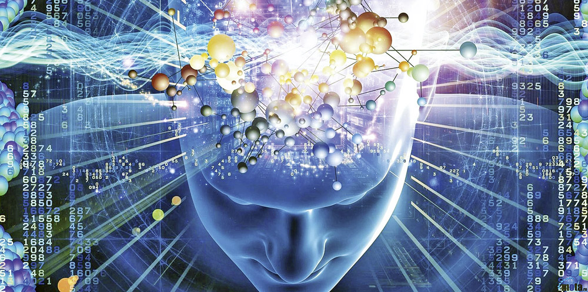
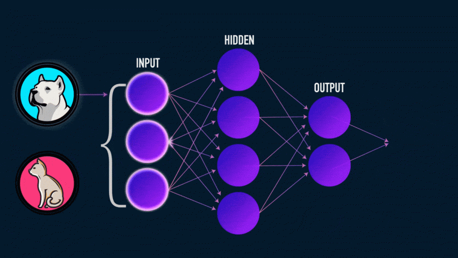

# Введение в интеллектуальные системы и технологии. Основные модели интеллектуальных систем

## Определение

Интеллектуальные системы - это программные или аппаратные средства, способные анализировать информацию, принимать решения, обучаться на основе опыта и применять полученные знания для выполнения задач, которые ранее требовали человеческого интеллекта. Эти системы используют методы и техники искусственного интеллекта (ИИ), чтобы эмулировать интеллектуальные функции человека.

## Значение и роль интеллектуальных систем

Интеллектуальные системы имеют огромное значение в современном мире. Они позволяют автоматизировать сложные и рутинные задачи, оптимизировать процессы, улучшать качество принимаемых решений и создавать новые возможности в различных сферах деятельности.

## Классификация интеллектуальных систем

### Экспертные системы

Экспертные системы - это системы, которые используют знания и опыт экспертов в конкретной области для принятия решений и решения сложных задач. Они способны анализировать информацию, задавать вопросы пользователю и предоставлять рекомендации. Примеры включают медицинские диагностические системы и системы поддержки проектирования.

### Системы поддержки принятия решений

Эти системы помогают организациям и индивидуальным лицам принимать обоснованные решения на основе анализа данных и моделей. Они используют методы статистики, оптимизации и прогнозирования для помощи в принятии стратегических и оперативных решений.

### Системы обработки естественного языка

Системы обработки естественного языка (NLP) позволяют компьютерам понимать, интерпретировать и генерировать человеческий язык. Они используются для создания чат-ботов, автоматического анализа текстов, машинного перевода и других задач, связанных с языком.

### Робототехника и автоматизация

Интеллектуальные системы также находят свое применение в робототехнике и автоматизации. Они позволяют роботам взаимодействовать с окружающей средой, выполнять задачи в сложных условиях и даже учиться новым навыкам.

### Машинное обучение и нейронные сети

Неотъемлемой частью интеллектуальных систем является машинное обучение, особенно нейронные сети, которые играют важную роль в обработке данных и анализе образов.

Машинное обучение - это подраздел искусственного интеллекта, который фокусируется на разработке алгоритмов и моделей, которые позволяют компьютерам "обучаться" на основе данных. В процессе машинного обучения система способна автоматически улучшать свою производительность через анализ опыта и данных.

Нейронные сети - это модели, вдохновленные структурой человеческого мозга. Они состоят из искусственных нейронов, которые связаны между собой и обрабатывают информацию. Нейронные сети обладают способностью обучаться, распознавать образы, выполнять задачи классификации, регрессии, обработки естественного языка и многие другие.

## Применение интеллектуальных систем

### Интеллектуальные системы в бизнесе

#### Прогнозирование спроса и оптимизация запасов

Прогнозирование спроса и оптимизация запасов – ключевые задачи для бизнеса. Интеллектуальные системы позволяют анализировать большие объемы данных, включая исторические продажи, сезонные факторы, погодные условия и даже данные из социальных сетей. С их помощью бизнес может более точно предсказать будущий спрос и подготовить оптимальные запасы товаров, минимизируя потери и избытки.

#### Рекомендательные системы

Рекомендательные системы помогают бизнесам предлагать персонализированные рекомендации клиентам. Эти системы анализируют предпочтения пользователей, исходя из истории их действий, и предлагают товары или услуги, которые могут заинтересовать клиента. Такие системы повышают уровень удовлетворенности клиентов и способствуют увеличению продаж.

#### Автоматизация бизнес-процессов

Интеллектуальные системы также используются для автоматизации бизнес-процессов. Они могут выполнять множество задач, от обработки заявок и запросов до мониторинга ресурсов и анализа данных. Это помогает бизнесу сократить время на выполнение рутинных задач, повышая эффективность работы.

### Интеллектуальные системы в медицине

#### Диагностика и прогнозирование заболеваний

Интеллектуальные системы имеют огромный потенциал в медицине. Они могут анализировать медицинские данные, такие как результаты анализов, изображения с медицинских аппаратов и даже генетическую информацию, чтобы помочь врачам более точно диагностировать заболевания и прогнозировать их развитие.

#### Анализ медицинских данных

Интеллектуальные системы могут обрабатывать большие объемы медицинских данных и выявлять паттерны, которые могут остаться незамеченными человеком. Это может помочь в открытии новых способов лечения, предотвращении эпидемий и повышении общего качества медицинской помощи.

### Интеллектуальные системы в транспорте

#### Автопилоты и системы безопасности в автомобилях

Интеллектуальные системы применяются в автопилотах и системах безопасности автомобилей. Они способны анализировать окружающую среду, распознавать другие транспортные средства и пешеходов, а также принимать аварийные меры в случае опасности. Это снижает риск аварий и повышает безопасность на дороге.

#### Оптимизация маршрутов и управление трафиком

Интеллектуальные системы позволяют оптимизировать маршруты движения транспортных средств, учитывая текущее состояние дорожного движения. Они также могут управлять трафиком, регулируя светофоры и оптимизируя поток автомобилей, что способствует снижению времени в пути и экономии топлива.

## Этические и социальные аспекты интеллектуальных систем

### Прозрачность и ответственность интеллектуальных систем

Прозрачность означает ясность и понимание того, как работают интеллектуальные системы. Вопросы о том, как принимаются решения, какие данные используются и какие алгоритмы применяются, становятся все более актуальными. Прозрачность важна, чтобы избежать недовольства и манипуляций. Компании и организации, разрабатывающие такие системы, должны стремиться к открытости и объяснимости своих технологий.

### Влияние на рабочие места и общество

Интеллектуальные системы, такие как искусственный интеллект и автоматизированные процессы, могут значительно изменить традиционные рабочие модели. Некоторые виды работ могут быть автоматизированы, что может повлиять на рабочие места. Однако новые возможности также могут появиться в областях разработки, обслуживания и контроля этих систем.

### Будущие направления развития

Расширенная реальность и виртуальная реальность:
Расширенная реальность (AR) и виртуальная реальность (VR) предоставляют возможности для создания уникальных визуальных и восприятийных опытов. Они могут применяться в развлечениях, образовании, медицине, а также в бизнесе для обучения, виртуальных встреч и т.д. Однако возникают вопросы о злоупотреблении данными, воздействии на здоровье и зависимости.

Интернет вещей и умные города:
Интернет вещей (IoT) объединяет физические устройства и сенсоры через интернет, что позволяет собирать и анализировать большие объемы данных для улучшения эффективности и качества жизни. Умные города используют технологии IoT для оптимизации инфраструктуры, управления транспортом, энергосбережения и обеспечения безопасности. Однако существуют риски в области приватности данных и безопасности.

### Интеллектуальные системы в науке и искусстве

Интеллектуальные системы проникают во многие сферы науки и искусства. В науке они могут помогать в обработке и анализе больших объемов данных, моделировании сложных процессов и создании новых гипотез. В искусстве интеллектуальные системы используются для создания музыки, изобразительного искусства, литературы и других творческих произведений.

