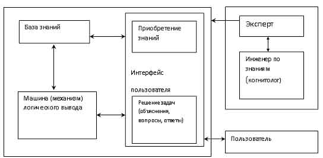
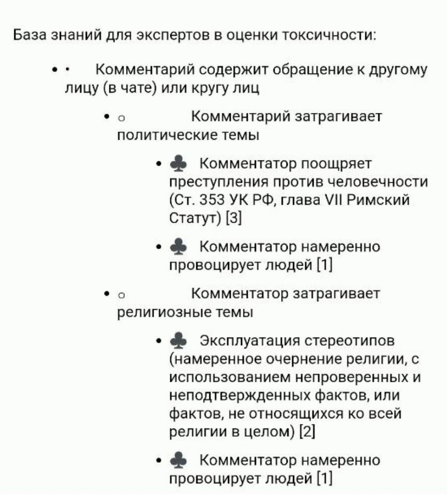

# Экспертные системы

## Определение

Экспертные системы - это программные системы, созданные с целью решения задач, требующих экспертных знаний и опыта. Они используют знания, полученные от специалистов в конкретной области, чтобы анализировать данные, делать выводы и принимать решения. Экспертные системы способны решать сложные проблемы, которые обычно требовали бы вмешательства человека-эксперта.

Основные компоненты экспертных систем включают:

1. Базу знаний: Это хранилище экспертных знаний, правил, фактов и эвристик, полученных от специалистов в определенной области. База знаний является ключевой частью системы, так как на ее основе происходит анализ и принятие решений.
2. Механизм вывода: Этот компонент отвечает за логическое рассуждение на основе информации из базы знаний. Механизм вывода использует правила и факты, чтобы делать заключения и формулировать решения.
3. Интерфейс пользователя: Экспертные системы обычно имеют интерфейс, который позволяет пользователю задавать вопросы, предоставлять данные и получать рекомендации или решения.

## Примеры областей применения экспертных систем

Рассмотрим разнообразные области, в которых экспертные системы нашли свое применение:

- Медицина: Экспертные системы могут помочь врачам в диагностике заболеваний, предоставляя анализ симптомов пациента и сравнивая их с базой медицинских знаний. Например, системы могут помочь определить возможные диагнозы и предложить план лечения.
- Финансы: В финансовой сфере экспертные системы могут анализировать рыночные тренды, данные о прошлых инвестициях и рисках, чтобы предоставить рекомендации по инвестированию и прогнозированию изменений на рынке.
- Инженерия: В инженерной области экспертные системы могут применяться для диагностики и ремонта сложных машин и устройств. Они помогают инженерам в выявлении неисправностей и предоставляют рекомендации по исправлению.
- Экология: В экологической сфере экспертные системы могут использоваться для анализа данных о загрязнении окружающей среды, прогнозирования климатических изменений и разработки стратегий по охране природы.
- Право и юриспруденция: Экспертные системы могут помочь юристам в исследовании законов и судебных решений, а также в предоставлении юридических консультаций на основе актуальных правовых данных.

## Ключевые компоненты экспертной системы

### База знаний

База знаний является одним из центральных компонентов экспертной системы. Это структурированное хранилище экспертных знаний, фактов, правил и эвристик, полученных от специалистов в конкретной предметной области. База знаний содержит информацию, которая используется для анализа данных и принятия решений.

Факты - это конкретные данные или утверждения о состоянии предметной области. Например, в медицинской экспертной системе фактом может быть "Пациент имеет повышенную температуру". Факты предоставляют основную информацию для анализа.

Правила - это логические высказывания, которые описывают, какие выводы следует делать на основе определенных фактов. Пример правила: "Если у пациента повышенная температура и боль в горле, то это может указывать на инфекцию верхних дыхательных путей". Правила определяют логику, по которой экспертная система делает заключения.

### Механизм вывода

Механизм вывода - это компонент, отвечающий за процесс логического рассуждения и формирования выводов на основе информации из базы знаний.

- Инференция: Это процесс логического вывода, при котором экспертная система использует правила, факты и эвристики, чтобы сделать новые заключения. Например, если база знаний содержит факт о повышенной температуре и правило о связи между температурой и инфекцией, система может сделать вывод о возможной инфекции у пациента.
- Логический вывод: Это процесс применения логических операций к фактам и правилам для получения новой информации. Система может использовать модус поненс (если... то...) или модус толленс (если не... то...) для получения заключений.

### Интерфейс пользователя

Интерфейс пользователя - это путь, по которому пользователь взаимодействует с экспертной системой. Он позволяет пользователю задавать вопросы, вводить данные и получать рекомендации или выводы.

- Текстовые интерфейсы: Эти интерфейсы позволяют пользователю вводить команды и запросы в текстовой форме. Это может быть командная строка или текстовое поле для ввода.
- Графические интерфейсы: Графические интерфейсы предоставляют пользователю графический способ взаимодействия, такой как кнопки, меню, окна и элементы управления.
- Голосовые интерфейсы: С помощью голосовых интерфейсов пользователь может диктовать команды или задавать вопросы голосом, а система будет интерпретировать их и предоставлять ответы.

## Создание экспертной системы

### Захват знаний

#### Методы сбора экспертных знаний: интервьюирование, анкетирование, анализ документации

Создание экспертной системы начинается с захвата экспертных знаний. Экспертные знания могут быть получены с помощью различных методов:

1. Интервьюирование: Этот метод включает беседы с экспертами, в ходе которых задаются вопросы и записываются их ответы. Эксперты могут подробно объяснить свои решения и рассказать о своем опыте.
2. Анкетирование: В данном случае эксперты могут заполнять анкеты, содержащие вопросы по предметной области. Это может помочь получить структурированные данные.
3. Анализ документации: Экспертные знания могут быть извлечены из существующей документации, таких как научные статьи, руководства или стандарты.

#### Роль экспертов в создании базы знаний

Эксперты играют ключевую роль в создании базы знаний. Они предоставляют ценные знания, которые затем формализуются и включаются в базу. Важно учесть, что сотрудничество с экспертами обеспечивает адекватность и актуальность получаемых данных.

#### Процесс формализации знаний в виде правил и фактов

После сбора экспертных знаний происходит их формализация. Это означает перевод неструктурированных знаний в форму, понятную для компьютера. Знания могут быть формализованы в виде правил и фактов:

- Факты: Конкретные данные, утверждения или состояния в предметной области, такие как "Пациент имеет высокую температуру".
- Правила: Логические высказывания, описывающие, какие выводы можно сделать на основе фактов. Например, "Если температура выше 38 градусов, то это может указывать на инфекцию".

### Представление знаний в экспертной системе

#### Фреймы: структура представления информации

Фреймы - это структуры данных, представляющие сущности и их атрибуты в предметной области. Они позволяют описывать сложные понятия и взаимосвязи между ними. Например, в медицинской экспертной системе фрейм может представлять пациента со свойствами "имя", "возраст", "симптомы" и т.д.

#### Продукционные правила: структура и примеры

Продукционные правила - это основной способ формализации знаний в экспертной системе. Они имеют следующую структуру: "Если (условие), то (действие)". Например, "Если у пациента высокая температура, то рекомендовать принять жаропонижающее".

#### Механизм вывода

- Прямой логический вывод: В этом случае система использует факты и правила для получения новых выводов. Например, если факт "Пациент имеет кашель" и правило "Кашель может быть связан с простудой", то система делает вывод о возможной простуде.
- Обратный логический вывод: Здесь система начинает с желаемого результат и работает назад к фактам, которые подтверждают или опровергают данный результат. Например, если система хочет определить диагноз пациента, она может начать с диагноза и искать факты, подтверждающие или опровергающие его.

### Инструменты создания экспертных систем

- Готовые решения
- Свои разработки

## Преимущества использования экспертных систем

- Скорость и эффективность: Экспертные системы способны анализировать и обрабатывать большие объемы информации в короткие сроки. Они оперируют знаниями и правилами, что позволяет быстро принимать решения и выполнять задачи без человеческой задержки.
- Точность: Экспертные системы способны обрабатывать информацию с высокой степенью точности. Они исключают возможность человеческих ошибок, связанных с усталостью, невнимательностью или личными предубеждениями.
- Доступность: Экспертные системы позволяют распределить экспертное знание по широкому кругу пользователей. Это особенно полезно, когда экспертов сложно найти или их знания ограничены географически.
- Сохранение знаний: Экспертные системы позволяют сохранить и структурировать знания опытных специалистов. Это особенно ценно в случае ухода эксперта на пенсию или его временной недоступности.

## Недостатки использования экспертных систем

- Ограниченность области знаний: Экспертные системы действуют в рамках той предметной области, для которой они разработаны. Они не способны обобщать свои знания на новые, непредусмотренные ситуации.
- Сложность захвата знаний: Создание экспертной системы требует оцифровки и формализации экспертных знаний, что может быть сложным и трудоемким процессом. Требуется участие экспертов для выявления и формулировки правил, что может быть дорого и затратно по времени.
- Неадаптивность: Экспертные системы не могут самостоятельно обновлять свои знания. Если в предметной области происходят изменения или новые открытия, экспертам придется вручную вносить изменения в систему.
- Невозможность анализа контекста: Экспертные системы могут быть ограничены в способности адаптироваться к различным контекстам или учитывать нюансы, которые могут повлиять на решение задачи.
- Зависимость от качества знаний: Если знания, на которых базируется экспертная система, недостаточно точны или устарели, это может привести к неверным решениям и снижению эффективности системы.

## Современные тенденции в развитии экспертных систем

1. Интеграция машинного обучения и искусственного интеллекта: В последние годы наблюдается слияние классических экспертных систем с методами машинного обучения. Это позволяет системам адаптироваться к новым ситуациям, находить закономерности в данных и улучшать качество своих решений.
2. Применение нейронных сетей в экспертных системах: Нейронные сети, способные анализировать большие объемы данных и выявлять скрытые зависимости, находят свое применение в экспертных системах. Они помогают расширить спектр задач, которые может эффективно решать экспертная система.
   
## Будущее экспертных систем

1. Расширение областей применения: В будущем ожидается значительное расширение сфер, где можно будет применять экспертные системы. Например, медицина, финансы, образование, производство и другие отрасли смогут воспользоваться этими системами для оптимизации процессов и принятия решений.
2. Улучшение процессов захвата и обновления знаний: Один из главных недостатков экспертных систем – сложность захвата и обновления знаний. В будущем ожидается разработка более эффективных методов сбора информации и обучения систем, что позволит быстрее и качественнее адаптироваться к изменяющимся условиям.
3. Автоматизация принятия решений: С развитием и совершенствованием искусственного интеллекта, экспертные системы будут все чаще использоваться для автоматизации принятия решений в сложных и неоднозначных ситуациях. Это может привести к более эффективному управлению процессами и ресурсами.
4. Создание гибридных систем: В будущем ожидается появление гибридных систем, объединяющих экспертные системы с другими технологиями и методами искусственного интеллекта, такими как обработка естественного языка, компьютерное зрение и робототехника.