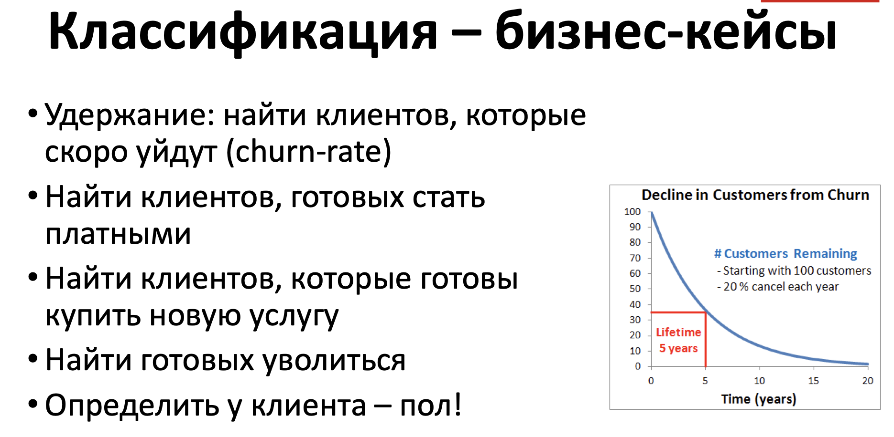

# Введение в машинное обучение

## Определение

Машинное обучение (Machine Learning) - это раздел искусственного интеллекта, который обучает компьютерные системы находить закономерности в данных и принимать решения, не явно программированные разработчиками. Оно отличается от традиционных методов программирования, где разработчик предоставляет явные инструкции компьютеру для выполнения задач.

Традиционный подход:

Программист пишет код, который определяет точные шаги выполнения задачи.

Машинное обучение:

Система обучается на данных, извлекая закономерности и оптимизируя свои параметры для достижения цели.
Основное отличие здесь - в том, что в машинном обучении мы учим систему обучаться на опыте, а не жестко задаем ей правила.

## Применение машинного обучения

- Классификация: Машинное обучение используется для автоматической классификации данных. Например, определение спама в электронной почте, распознавание рукописного текста или даже диагностика медицинских состояний.
- Регрессия: Машинное обучение может предсказывать численные значения на основе имеющихся данных. Это может быть прогнозирование цен на недвижимость, доходности акций или климатических изменений.
- Кластеризация: Машинное обучение позволяет группировать данные по схожим признакам. Например, сегментация клиентов в маркетинге или выделение сходных структур в медицинских изображениях.
- Рекомендательные системы: Машинное обучение применяется для предсказания предпочтений пользователей и рекомендации товаров, фильмов или музыки.
- Обработка естественного языка: Эта область занимается анализом и генерацией текста, переводом языков, и даже созданием чат-ботов.

## В чем подвох?

+ Нужны данные
+ Данные должны быть специализированы
+ Где брать данные

Что на картинке?

А на этой?

+ Много учиться
+ Знать математику
+ Уметь писать код
+ Уметь исследовать

Почему результат плохой? Где ошибка? В данных, в модели, в коэффициентах, в коде, в голове?

+ Сложная цепочка:
  + Сбор данных
  + Фильтрация и валидация
  + Обучение модели
  + Контроль качества

### Знания

- Логика - это область математики, изучающая правила заключения и доказательства. Она используется для анализа и формализации процессов рассуждения и принятия решений.
- Реляционная алгебра - это часть математики, связанная с алгебраическими операциями над множествами данных, представленными в виде таблиц (реляционных баз данных). Она используется в базах данных для выполнения запросов и анализа данных.
- Дискретная математика - это раздел математики, изучающий дискретные объекты, такие как целые числа и конечные множества. Она используется в компьютерных науках для решения задач, связанных с дискретными структурами данных и алгоритмами.
- Теория графов - изучает графы, которые представляют собой совокупность вершин и рёбер. Она применяется в решении задач маршрутизации, сетевого проектирования и анализе социальных сетей.
- Теория автоматов - изучает абстрактные вычислительные машины и формальные языки. Она имеет применение в компиляции, разработке языков программирования и автоматическом анализе текста.
- Комбинаторика - это наука о перестановках, сочетаниях и размещениях элементов множества. Она используется в задачах, связанных с подсчётом, структурами данных и кодированием информации.
- Теория кодирования - изучает методы представления данных с минимальной ошибкой. Она играет важную роль в передаче данных по каналам связи и в хранении информации.
- Теория алгоритмов - эта область занимается изучением алгоритмов, их анализом и сложностью. Она помогает разрабатывать эффективные алгоритмы для решения различных задач, от сортировки данных до поиска оптимальных маршрутов.
- Линейная алгебра изучает линейные отображения и их свойства. Она широко используется в науке, инженерии, компьютерной графике и многих других областях для работы с векторами, матрицами и системами линейных уравнений.
- Интегралы - это часть математики, изучающая понятие интеграла и его применение для нахождения площадей, объемов, центров масс и многих других физических и геометрических характеристик.
- Теория вероятностей изучает случайные явления и вероятности. Она применяется в статистике, машинном обучении, физике, экономике и других областях для моделирования и анализа неопределенности.
- Теория оптимизации занимается поиском оптимальных решений в задачах, где нужно минимизировать или максимизировать некоторую функцию. Численные методы предоставляют алгоритмы для приближенного решения оптимизационных задач.

## Работа с данными

Работает аналитик

## Разделы машинного обучения

### Кластерный анализ

### Классификация

### Регрессия

